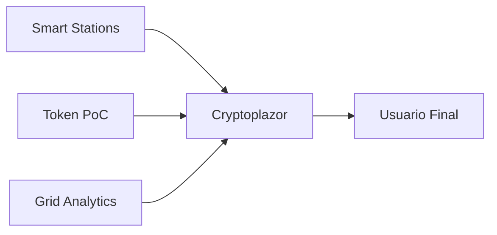
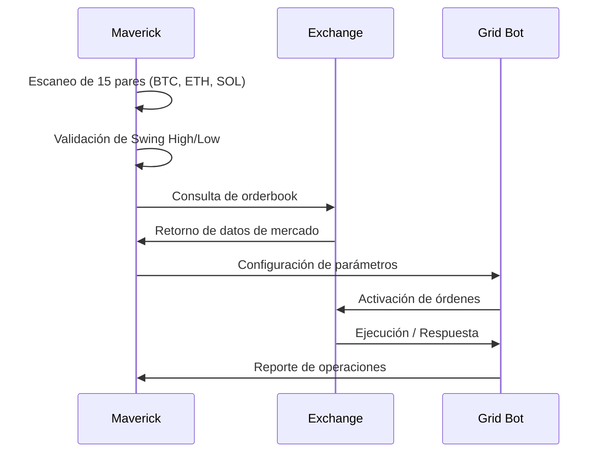
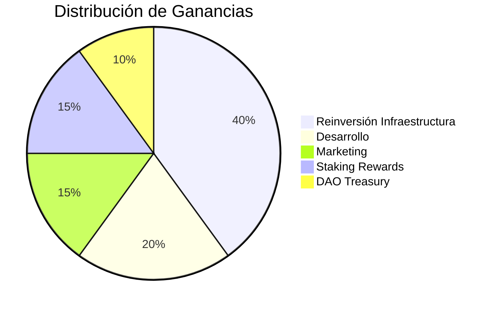

# 🚀 CryptoPlaza: Ecosistema FinTech 3.0


<div align="center">
  <a href="#vision">Visión</a> •
  <a href="#etapas">Etapas</a> •
  <a href="#rutas">Rutas</a> •
  <a href="#maverick">Estrategia Maverick</a> •
  <a href="#sinergia">Sinergia Goose-Maverick</a> •
  <a href="#roadmap">Roadmap</a> •
  <a href="#contribuir">Contribuir</a>
</div>

---

## <a name="vision"></a>💡 Visión General del Ecosistema

CryptoPlaza es un ecosistema autogestionable que integra tecnologías disruptivas (IA, Blockchain, ML, IPFS, IoT) bajo la filosofía FinTech 3.0, diseñado para:

- ✅ **Tokenizar** activos y procesos mediante un Token Proof-of-Concept (PoC)
- ✅ **Generar** sinergias entre modelos de ingresos orgánicos y algoritmos de optimización financiera
- ✅ **Implementar** un sistema gamificado para la adopción masiva de tecnologías descentralizadas

> *"CryptoPlaza representa la evolución necesaria de las FinTech hacia modelos autosuficientes y comunitarios."*

---

## <a name="etapas"></a>🌟 Etapas Clave del Proyecto

### Etapa I: Instalación de la Estrategia Base


**Objetivo:** Optimizar presupuestos de I+D mediante Seed Generators.

#### Componentes Principales:

<details>
<summary><b>🖥️ Smart Stations</b> (Expandir para detalles)</summary>
<br>
Nodos físicos/virtuales que integran:

- 🔄 Seeding para BTT (almacenamiento P2P rentabilizado)
- 🧮 Renta de GPUs (Salad.com, Vast.ai)
- 📱 Earn App (monetización pasiva de recursos inactivos)

**Requerimientos Técnicos:**
- CPU: 4+ núcleos
- RAM: 8GB mínimo
- Almacenamiento: 1TB+ HDD/SSD
- Conexión: 100+ Mbps simétrica
</details>

<details>
<summary><b>🦢 Goose AI</b> (Expandir para detalles)</summary>
<br>
Asistente encargado de:

- 🤖 Gestión automática de recursos en Smart Stations
- 💰 Distribución de ganancias a stakeholders:
  - 40% reinversión
  - 60% reparto a participantes

**Stack Tecnológico:**
- TensorFlow/PyTorch para modelado predictivo
- Docker para despliegue modular
- Comunicación via API REST/GraphQL
</details>

### Etapa II: Integración Comercial y Gamificación


#### Acciones Clave:

| Componente | Descripción | Implementación |
|------------|-------------|----------------|
| 🏞️ **Tierras Virtuales** | NFTs representativos en BNB Chain | Smart Contracts ERC-721 |
| 🎟️ **Cupones Web 3.0** | Sistema de recompensas con tokens propios | Protocolo BEP-20 |
| 🎮 **Gamificación** | Misiones educativas sobre blockchain | Interfaz Unity/Web3.js |

### Etapa III: Escalabilidad y Operaciones


**Foco:** Consolidación del token PoC y expansión del grid de Smart Stations.

#### Herramientas Principales:



**Cryptoplazor:** Interfaz unificada para gestión de activos, analytics y visualización de rendimiento.

---

## <a name="rutas"></a>🛣️ Rutas Operativas

### Ruta Comercial


#### Fases de Implementación:

- **Pre-Lanzamiento** ⏳
  - [ ] Campañas de community building en Discord
  - [ ] Eventos de engagement en Telegram
  - [ ] Participación en hackathons Web3

- **Lanzamiento** 🚀
  - [ ] Venta de tierras virtuales NFT
  - [ ] Programa de acceso prioritario a Smart Stations
  - [ ] IDO del token PoC

- **Post-Venta** 📈
  - [ ] Programa de staking con bonificaciones
  - [ ] Desarrollo de DAO para gobernanza
  - [ ] Expansión de utilidades del token

### Ruta de Desarrollo


#### Tecnologías Integradas:

```jsx
// Ejemplo de conexión al puente BNB Chain
const connectToBridge = async () => {
  try {
    const bridge = await BNBBridge.connect({
      providerUrl: 'https://bsc-dataseed.binance.org/',
      walletAddress: currentWallet,
      contractAddress: CRYPTOPLAZA_CONTRACT
    });
    
    return bridge.initialize();
  } catch (error) {
    console.error("Error connecting to bridge:", error);
    return null;
  }
}
```

- **Puente a BNB Chain:** Interoperabilidad para transacciones rápidas y bajo costo
- **Securitización On-Chain:** Registro inmutable de activos en IPFS con referencias blockchain

---

## <a name="maverick"></a>📊 Estrategia Maverick: Grid Bots de Futuros

**Objetivo:** Generar ≈3% diario de interés compuesto mediante trading algorítmico automatizado.

### Parámetros de Configuración

| Factor | Descripción Técnica | Importancia |
|--------|---------------------|-------------|
| 📈 **Contexto de Mercado** | Análisis en tiempo real de tendencias (LONG/SHORT) con IA predictiva | Alta |
| 📏 **Trazado de Rangos** | Identificación de Swing Highs/Lows validados por 3 velas consecutivas (TF 1H) | Media |
| 🏃 **Momentum** | Confirmación mediante RSI (70/30) y volumen | Alta |
| ⚙️ **Optimización Grids** | Ratio grids/apalancamiento ajustado a volatilidad (ej.: 50 grids x5 leverage) | Crítica |
| 🛡️ **Gestión de Riesgo** | Stop-loss dinámico en 0.786 Fibonacci + límite de 2% por operación | Crítica |

### Workflow de Ejecución



#### Proceso:

1. **Detección de Oportunidades:**
   - [x] Maverick escanea continuamente 15 pares principales en Binance Futures
   - [x] Aplicación de filtros técnicos para reducir falsos positivos

2. **Validación de Niveles:**
   - [x] Swing High: Pico seguido de 2 lower highs
   - [x] Swing Low: Valle seguido de 2 higher lows

3. **Ejecución Automatizada:**
   - [x] Grid bot activa órdenes en rangos predefinidos con escalado dinámico
   - [x] Sistema de take-profit parcial para asegurar ganancias

---

## <a name="sinergia"></a>🔄 Modelo de Autogestión: Sinergia Goose-Maverick


### Flujo Operativo:

```
Smart Stations (Goose) → Fondos Generados → Alimentación Maverick → Ganancias → Reinversión en Smart Stations
```

#### Panel de Control Goose-Maverick

| Componente | KPI Principal | Meta |
|------------|---------------|------|
| 🦢 **Goose** | ROI mensual | ≥15% |
| 🦅 **Maverick** | ROI anual | 60-90% |
| 🔄 **Ciclo Completo** | Tiempo de recuperación | <6 meses |

### Distribución de Recursos



---

## <a name="roadmap"></a>📅 Hoja de Ruta Técnica

| Trimestre | Hito Principal | Tecnologías Involucradas | Estado |
|-----------|----------------|--------------------------|--------|
| Q4 2024 | Lanzamiento Beta de Cryptoplazor | React, Solidity, TensorFlow | ⏳ Planificado |
| Q1 2025 | Integración completa BNB Chain | IPFS, Chainlink Oracles | 📝 Diseño |
| Q2 2025 | Gamificación con NFTs educativos | Unity, Unreal Engine (3D) | 💡 Concepto |

### Checklist de Implementación:

- [ ] **Infraestructura**
  - [ ] Configuración de nodos BNB Chain
  - [ ] Despliegue de Smart Stations beta
  - [ ] Implementación de API para Goose

- [ ] **Desarrollo**
  - [ ] Smart Contracts para tokens PoC
  - [ ] Frontend de Cryptoplazor
  - [ ] Integración Maverick-Exchange

- [ ] **Comunidad**
  - [ ] Lanzamiento de Discord oficial
  - [ ] Programa de embajadores
  - [ ] Hackathon interno

---

## Visualización UI/UX

### Dashboard Interactivo:


#### Componentes Clave:

- **Sección "Seed Generators"**: Monitoreo en tiempo real de Smart Stations
  - Métricas de rendimiento
  - Estado de nodos
  - Histórico de ganancias

- **Módulo "Maverick Analytics"**: 
  - Gráficos de rendimiento de bots
  - Histórico de operaciones
  - Métricas de riesgo/beneficio

---

## <a name="contribuir"></a>🤝 Contribuir al Proyecto

CryptoPlaza es un proyecto comunitario abierto a desarrolladores, inversores y entusiastas Web3.

### Cómo Participar:

```bash
# Clonar el repositorio
git clone https://github.com/CryptoPlazaHQ/ecosystem.git

# Instalar dependencias
npm install

# Ejecutar entorno de desarrollo
npm run dev
```

### Áreas de Contribución:

- 💻 Desarrollo de Smart Contracts
- 🎨 Diseño UI/UX
- 📊 Optimización de Algoritmos Maverick
- 📝 Documentación y Tutoriales
- 🌐 Traducción y Localización

---

<div align="center">

## ¿Listo para ser parte de la revolución FinTech 3.0?

[](https://github.com/CryptoPlazaHQ/ecosystem) [](https://discord.gg/cryptoplaza) [](https://twitter.com/CryptoPlazaHQ)

[⭐ Star el repositorio](https://github.com/CryptoPlazaHQ/ecosystem) | [🛠️ Contribuir](https://github.com/CryptoPlazaHQ/ecosystem/contribute) | [🌐 Unirse al Discord](https://discord.gg/cryptoplaza)

</div>

---

> **Disclaimer:** Este documento es una versión resumida. Para detalles técnicos completos, consulte los whitepapers en el repositorio.
