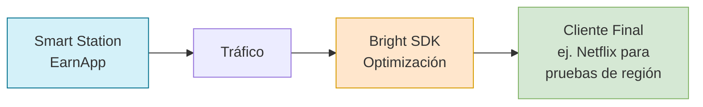

# Documento Estratégico: Integración de EarnApp y Bright SDK en CryptoPlaza


> **Versión 1.1** | **FinTech 3.0** | **Smart Stations & Monetización de Recursos**  
> 📚 [Repositorio GitHub](https://github.com/cryptoplaza)

## 📑 Índice de Contenidos

- [1. Introducción a EarnApp](#1-introducción-a-earnapp)
- [2. Potencial de EarnApp en CryptoPlaza](#2-potencial-de-earnapp-en-cryptoplaza)
- [3. Alianza con Bright SDK](#3-alianza-con-bright-sdk)
- [4. Implementación Técnica en Smart Stations](#4-implementación-técnica-en-smart-stations)
- [5. Estrategia de Crecimiento](#5-estrategia-de-crecimiento)
- [6. Riesgos y Mitigación](#6-riesgos-y-mitigación)
- [7. Conclusión](#7-conclusión)
- [8. Recursos Adicionales](#8-recursos-adicionales)

---

## 1. Introducción a EarnApp


EarnApp es una plataforma descentralizada que permite a los usuarios monetizar recursos inactivos, principalmente ancho de banda de internet, compartiéndolo con empresas que requieren servicios proxy y VPN para web scraping, pruebas de seguridad o análisis de mercado.

### 🔄 Mecanismo de Ganancia

1. Los usuarios instalan un cliente ligero en sus dispositivos (PC, móvil, servidor)
2. EarnApp redirige tráfico cifrado y anónimo a través de la conexión del usuario
3. **Recompensas**: Pagos en USD (vía PayPal) o criptomonedas (BTC, ETH) proporcionales al ancho de banda compartido

### 📊 Métricas Clave

| Métrica | Valor Promedio |
|---------|----------------|
| Ganancia Mensual/Dispositivo | $5−20 USD |
| Consumo de Recursos | <5% CPU, 50 MB RAM |
| Compatibilidad | Windows, Linux, Android |

---

## 2. Potencial de EarnApp en CryptoPlaza

### 2.1 Sinergia con Smart Stations

Las Smart Stations de CryptoPlaza integran múltiples fuentes de ingresos pasivos:

- 🗄️ **BTT Seeding** (almacenamiento P2P)
- 🖥️ **Renta de GPUs** (Salad, Vast.ai)
- 📡 **EarnApp** (monetización de ancho de banda)


#### Ventajas Clave:

- **Diversificación de Ingresos**: Añade un flujo adicional sin competir por recursos (la red no afecta a GPU/almacenamiento)
- **Escalabilidad**: Funciona en dispositivos de bajo consumo (Raspberry Pi, routers)
- **Bajo Mantenimiento**: Configuración inicial única

### 2.2 Proyección Financiera

| Número de Dispositivos | Ganancia Mensual (USD) | ROI Anual (USD) |
|------------------------|------------------------|-----------------|
| 50 | $500−1,000 | $6,000−12,000 |
| 200 | $2,000−4,000 | $24,000−48,000 |

> **💡 Nota**: Las proyecciones asumen una utilización óptima y estabilidad de red.

---

## 3. Alianza con Bright SDK

Bright SDK (Partners) es una plataforma que optimiza la monetización de datos para aplicaciones, ofreciendo herramientas para:

- **Gestión de SDKs**: Integración simplificada de servicios como anuncios, VPN y proxies
- **Analítica Avanzada**: Segmentación de tráfico por ubicación, dispositivo y tipo de dato


### 3.1 Beneficios de la Integración

| Área | Ventaja para CryptoPlaza |
|------|--------------------------|
| Monetización | Aumenta el CPM (costo por mil impresiones) hasta un 30% al priorizar tráfico premium (ej.: empresas de EE.UU./UE) |
| Seguridad | Cifrado AES-256 y compliance con GDPR/CCPA para tráfico compartido |
| Eficiencia Operativa | Dashboard unificado para monitorear ganancias de EarnApp + otras Smart Stations |

### 3.2 Caso de Uso: Proxy para Empresas

**Empresas asociadas a Bright SDK**: Empresas de marketing digital, servicios de streaming y auditorías de seguridad.

#### Flujo de Valor:



**Comisión por Transacción**: 15-20% del pago recibido por Bright SDK.

---

## 4. Implementación Técnica en Smart Stations

### 4.1 Requisitos

#### Hardware Mínimo:

- **CPU**: Dual-core 1.2 GHz
- **RAM**: 1 GB
- **Almacenamiento**: 10 GB (SSD recomendado)

#### Software:

- **SO**: Ubuntu Server 22.04 LTS
- **Docker** (para contenerización de EarnApp + BTT clients)


### 4.2 Configuración Automatizada con Goose AI

El asistente Goose gestiona:

#### Despliegue de EarnApp:

```bash
docker run -d --name earnapp \
-e EMAIL="usuario@cryptoplaza.io" \
-v /opt/earnapp:/etc/earnapp \
earnapp/earnapp
```

#### Priorización de Tráfico: 
Asigna ancho de banda según demanda:
- 60% BTT
- 30% EarnApp
- 10% GPUs

#### Pagos Automáticos: 
Conversión de USD a BTT/ETH mediante APIs de Binance.

---

## 5. Estrategia de Crecimiento

### 5.1 Fase Inicial (Etapa I)

**Objetivo**: 100 dispositivos activos en 3 meses.

#### Acciones:

- **Programa de Referidos**: 10% de comisión por cada nuevo nodo invitado
- **Gamificación**: NFTs de "Pionero Web3" para usuarios con >500 GB compartidos/mes


### 5.2 Escalabilidad (Etapa III)

- **Red Global**: Alianza con proveedores de internet locales para desplegar Smart Stations en zonas con exceso de ancho de banda (ej.: universidades, coworkings)
- **Tokenización**: Conversión del 20% de las ganancias de EarnApp al token PoC de CryptoPlaza para staking

---

## 6. Riesgos y Mitigación

| Riesgo | Mitigación |
|--------|------------|
| Regulación de tráfico P2P | Usar Bright SDK para filtrar tráfico por jurisdicciones "amigables" |
| Sobreuso de ancho de banda | Límites dinámicos configurados por Goose AI (máx. 80% de la conexión) |
| Competencia | Diferenciación mediante integración con BTT + GPUs |


---

## 7. Conclusión

La integración de EarnApp + Bright SDK en las Smart Stations posiciona a CryptoPlaza como un ecosistema líder en monetización de recursos descentralizados. Este modelo no solo genera flujos recurrentes, sino que también atrae a usuarios y empresas mediante incentivos tokenizados y compliance regulatorio.

### Pasos Inmediatos:

1. Implementar nodos piloto en 10 ubicaciones (Q4 2024)
2. Firmar acuerdo de partnership con Bright SDK (Solicitar acceso)
3. Publicar tutoriales técnicos en el repositorio GitHub

---

## 8. Recursos Adicionales

### Documentación Relacionada:
- [Whitepaper de Smart Stations](https://cryptoplaza.io/whitepaper)
- [Bright SDK API Documentation](https://brightsdk.io/docs)
- [Guía de Implementación para Desarrolladores](https://cryptoplaza.io/dev-guide)

### Enlaces Útiles:
- [FAQ Sobre Integración](https://cryptoplaza.io/faq)
- [Canal de Soporte Técnico](https://discord.gg/cryptoplaza)
- [Calendario de Actualizaciones](https://cryptoplaza.io/roadmap)

---

<div style="background-color: #f5f5f5; padding: 20px; border-radius: 8px; text-align: center; margin-top: 40px;">
  <h3>🚀 ¿Listo para contribuir?</h3>
  <p>
    <a href="https://cryptoplaza.io/nodos" style="background-color: #4CAF50; color: white; padding: 10px 20px; text-decoration: none; border-radius: 4px; margin-right: 10px;">Unirse al programa de nodos</a>
    <a href="https://dashboard.cryptoplaza.io" style="background-color: #2196F3; color: white; padding: 10px 20px; text-decoration: none; border-radius: 4px;">Ver métricas en vivo</a>
  </p>
</div>

---

<footer style="text-align: center; margin-top: 50px; font-size: 12px; color: #666;">
© 2024 CryptoPlaza | Todos los derechos reservados | <a href="mailto:info@cryptoplaza.io">info@cryptoplaza.io</a>
</footer>
