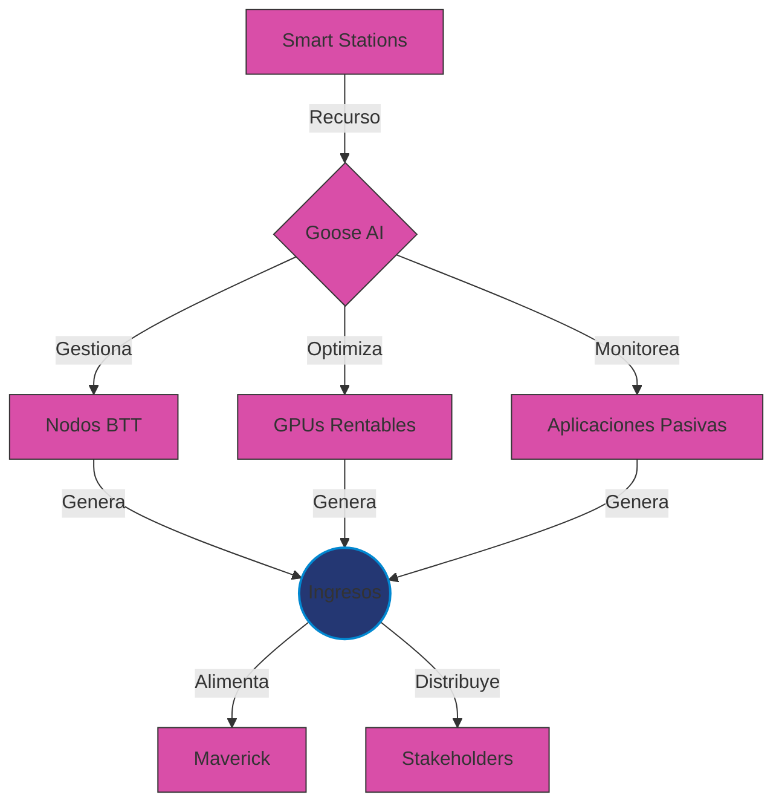
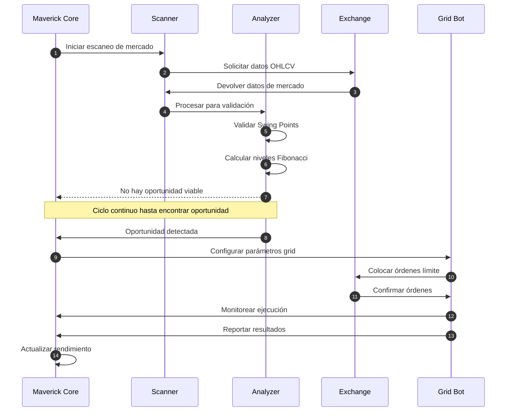
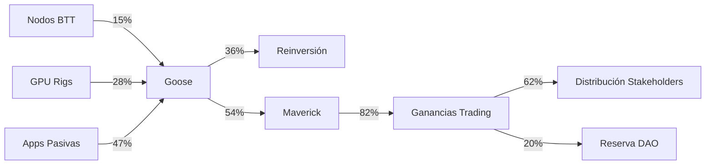

# 🚀 Goose & Maverick MVP

[
  
  <h3>Sistema Autónomo de Generación de Recursos para el Ecosistema CryptoPlaza</h3>

  
  
  
  

---

## 📋 Índice

- [Visión General](#-visión-general)
- [Componentes del Sistema](#-componentes-del-sistema)
- [Métricas de Rendimiento](#-métricas-de-rendimiento)
- [Demostración](#-demostración)
- [Casos de Uso](#-casos-de-uso)

---

## 🔭 Visión General

**Goose & Maverick** constituyen el núcleo del sistema autogestionable de CryptoPlaza, desarrollado para optimizar la generación de recursos y gestionar activos digitales de forma autónoma e inteligente.

[

### El Concepto en 60 Segundos

> Goose administra una red de nodos físicos/virtuales (Smart Stations) que generan ingresos pasivos, mientras Maverick utiliza estos recursos para trading algorítmico en mercados de futuros. El sistema completo opera como un ecosistema autosuficiente, reinvirtiendo y distribuyendo ganancias a los stakeholders.

---

## 🧩 Componentes del Sistema

### 1️⃣ Sistema Goose

<b>Expandir/Colapsar Detalles</b>

#### Características Principales de Goose
- **Autogestión**: Monitoreo 24/7 de recursos distribuidos
- **Optimización**: Ajuste dinámico basado en rentabilidad
- **Escalabilidad**: Integración sencilla de nuevos nodos
- **Distribución**: Reparto automático de ganancias (60% stakeholders, 40% reinversión)

### 2️⃣ Sistema Maverick

<b>Expandir/Colapsar Detalles</b>

  <table>
    <tr>
      <td width="60%">
        <h4>Algoritmo Grid Trading</h4>
        
      </td>
      <td width="40%">
        <h4>Parámetros Clave</h4>
        <ul>
          <li>🔍 <b>Detección</b>: Análisis de 15 pares principales</li>
          <li>📊 <b>Validación</b>: Patrones Swing High/Low</li>
          <li>⚖️ <b>Riesgo</b>: Máximo 2% por operación</li>
          <li>📈 <b>Leverage</b>: Adaptativo (3x-5x)</li>
          <li>🛡️ <b>Protección</b>: Stop-loss dinámico Fibonacci</li>
        </ul>
      </td>
    </tr>
  </table>

#### Flujo de Operación de Maverick

---

## 📊 Métricas de Rendimiento

### Rendimiento Histórico (MVP)

  <table>
    <tr>
      <th colspan="4">Periodo de Prueba: Enero - Marzo 2025</th>
    </tr>
    <tr>
      <td>
        
      </td>
      <td>
        
      </td>
    </tr>
  </table>

### KPIs del Sistema

  <table>
    <tr>
      <th>Componente</th>
      <th>ROI Mensual</th>
      <th>Estabilidad</th>
      <th>Eficiencia</th>
    </tr>
    <tr>
      <td align="center">
         
        <b>Goose</b>
      </td>
      <td>
        

          
50%

        

      </td>
      <td>
        

          ⭐⭐⭐⭐⭐
        

      </td>
      <td>
        

          ⭐⭐⭐⭐☆
        

      </td>
    </tr>
    <tr>
      <td align="center">
         
        <b>Maverick</b>
      </td>
      <td>
        

          
40-80%

        

      </td>
      <td>
        

          ⭐⭐⭐⭐☆
        

      </td>
      <td>
        

          ⭐⭐⭐⭐⭐
        

      </td>
    </tr>
    <tr>
      <td align="center">
         
        <b>Sistema Completo</b>
      </td>
      <td>
        

          
70-120%

        

      </td>
      <td>
        

          ⭐⭐⭐⭐⭐
        

      </td>
      <td>
        

          ⭐⭐⭐⭐⭐
        

      </td>
    </tr>
  </table>

----

# 🎮 Demostración

## Panel de Control Interactivo

 [
 

## Flujo de Valor en Tiempo Real

  
<em>Representación de flujo de recursos (unidades: % del total generado)</em>

---

### 💼 Casos de Uso

| Escenario | Solución | Resultados |
|-----------|----------|------------|
| 🏢 Empresas | Integración de Smart Stations en infraestructura existente | ROI adicional sin inversión extra, optimización de recursos tecnológicos, nuevas fuentes de ingresos pasivos |
| 👥 Comunidades | Implementación de clusters Goose-Maverick gestionados colectivamente | Democratización del acceso a trading algorítmico, distribución equitativa de beneficios, educación financiera práctica |
| 🧠 Desarrolladores | Plataforma para monetizar infraestructura durante tiempo inactivo | Subsidio de costos de desarrollo, utilización dual de hardware especializado, financiación automática para nuevos proyectos |

