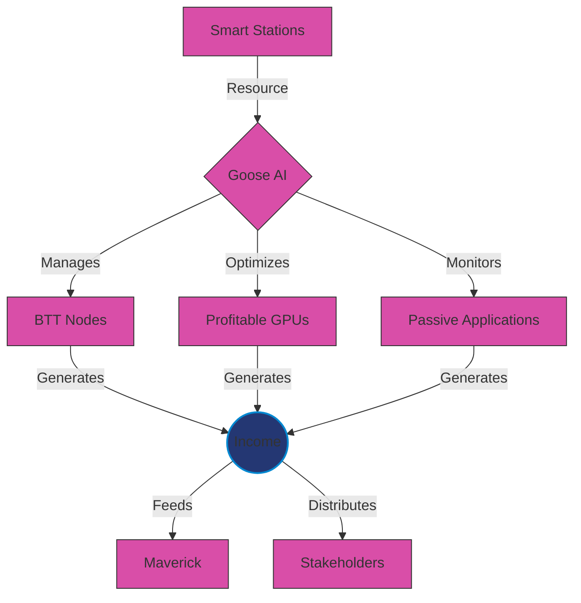
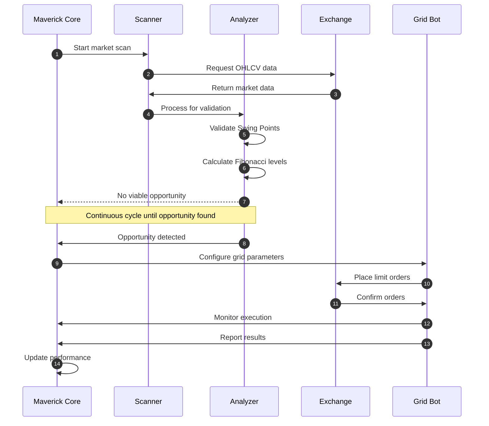
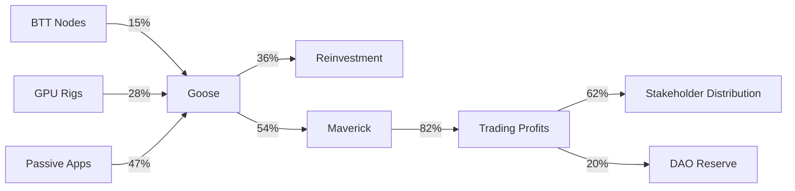

# 🚀 Goose & Maverick MVP

[
  
  <h3>Autonomous Resource Generation System for the CryptoPlaza Ecosystem</h3>

  
  
  
  

---

## 📋 Index

- [Overview](#-overview)
- [System Components](#-system-components)
- [Performance Metrics](#-performance-metrics)
- [Demonstration](#-demonstration)
- [Use Cases](#-use-cases)

---

## 🔭 Overview

**Goose & Maverick** constitute the core of CryptoPlaza's self-managed system, developed to optimize resource generation and manage digital assets autonomously and intelligently.

[

### The Concept in 60 Seconds

> Goose manages a network of physical/virtual nodes (Smart Stations) that generate passive income, while Maverick uses these resources for algorithmic trading in futures markets. The complete system operates as a self-sufficient ecosystem, reinvesting and distributing profits to stakeholders.

---

## 🧩 System Components

### 1️⃣ Goose System

<b>Expand/Collapse Details</b>

#### Main Features of Goose
- **Self-Management**: 24/7 monitoring of distributed resources
- **Optimization**: Dynamic adjustment based on profitability
- **Scalability**: Simple integration of new nodes
- **Distribution**: Automatic profit sharing (60% stakeholders, 40% reinvestment)

### 2️⃣ Maverick System

<b>Expand/Collapse Details</b>

  <table>
    <tr>
      <td width="60%">
        <h4>Grid Trading Algorithm</h4>
        
      </td>
      <td width="40%">
        <h4>Key Parameters</h4>
        <ul>
          <li>🔍 <b>Detection</b>: Analysis of 15 main pairs</li>
          <li>📊 <b>Validation</b>: Swing High/Low Patterns</li>
          <li>⚖️ <b>Risk</b>: Maximum 2% per operation</li>
          <li>📈 <b>Leverage</b>: Adaptive (3x-5x)</li>
          <li>🛡️ <b>Protection</b>: Dynamic Fibonacci stop-loss</li>
        </ul>
      </td>
    </tr>
  </table>

#### Maverick Operation Flow

---

## 📊 Performance Metrics

### Historical Performance (MVP)

  <table>
    <tr>
      <th colspan="4">Test Period: January - March 2025</th>
    </tr>
    <tr>
      <td>
        
      </td>
      <td>
        
      </td>
    </tr>
  </table>

### System KPIs

  <table>
    <tr>
      <th>Component</th>
      <th>Monthly ROI</th>
      <th>Stability</th>
      <th>Efficiency</th>
    </tr>
    <tr>
      <td align="center">
         
        <b>Goose</b>
      </td>
      <td>
        

          
50%

        

      </td>
      <td>
        

          ⭐⭐⭐⭐⭐
        

      </td>
      <td>
        

          ⭐⭐⭐⭐☆
        

      </td>
    </tr>
    <tr>
      <td align="center">
         
        <b>Maverick</b>
      </td>
      <td>
        

          
40-80%

        

      </td>
      <td>
        

          ⭐⭐⭐⭐☆
        

      </td>
      <td>
        

          ⭐⭐⭐⭐⭐
        

      </td>
    </tr>
    <tr>
      <td align="center">
         
        <b>Complete System</b>
      </td>
      <td>
        

          
70-120%

        

      </td>
      <td>
        

          ⭐⭐⭐⭐⭐
        

      </td>
      <td>
        

          ⭐⭐⭐⭐⭐
        

      </td>
    </tr>
  </table>

----

# 🎮 Demonstration

## Interactive Dashboard

 [
 

## Real-Time Value Flow

  
<em>Resource flow representation (units: % of total generated)</em>

---

### 💼 Use Cases

| Scenario | Solution | Results |
|-----------|----------|------------|
| 🏢 Businesses | Integration of Smart Stations into existing infrastructure | Additional ROI without extra investment, optimization of technological resources, new sources of passive income |
| 👥 Communities | Implementation of collectively managed Goose-Maverick clusters | Democratization of access to algorithmic trading, equitable distribution of benefits, practical financial education |
| 🧠 Developers | Platform to monetize infrastructure during idle time | Subsidizing development costs, dual use of specialized hardware, automatic funding for new projects |
