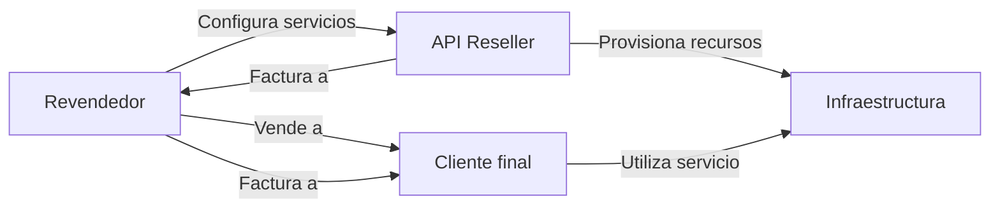
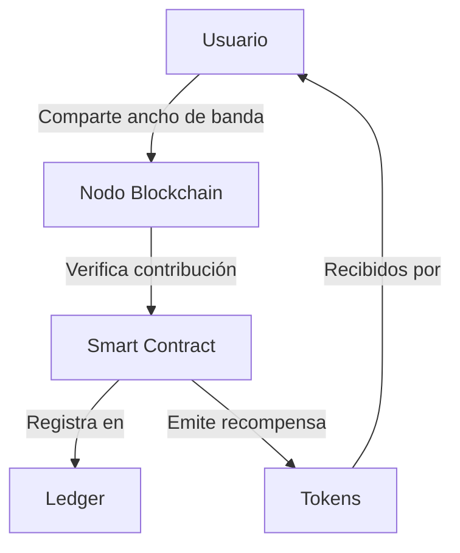
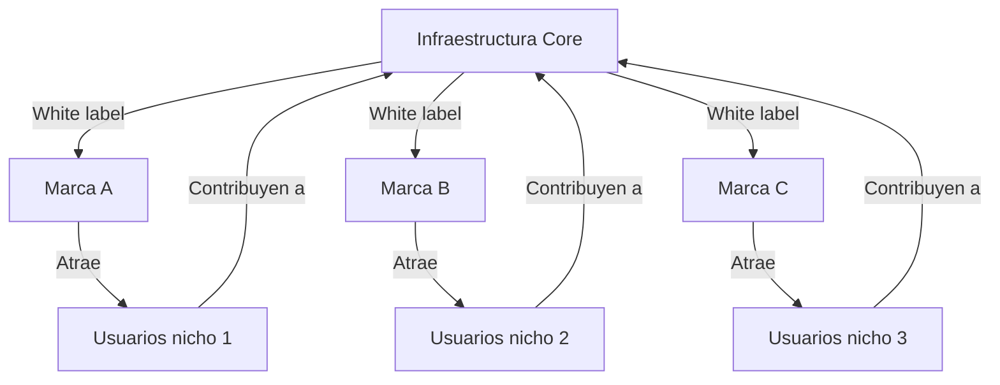
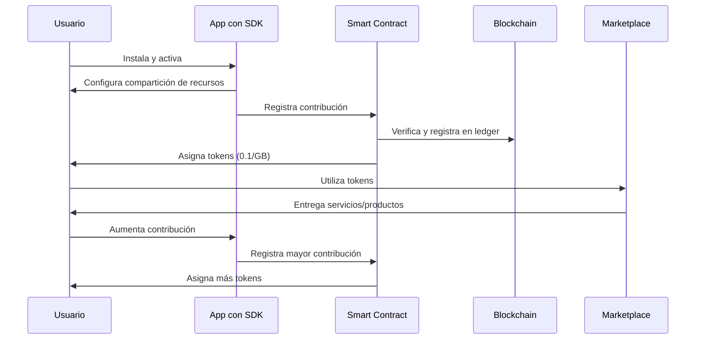

# Conceptos Clave y Ventajas de White Labelling y SDKs en Blockchain


## 📚 Guía Beginner-Friendly sobre Conceptos Esenciales

---

## 🔄 White Labelling

White labelling es una estrategia de negocio que permite a empresas ofrecer productos o servicios desarrollados por terceros bajo su propia marca.

### ¿Cómo funciona?
- **Producto base**: Una empresa crea un producto o servicio funcional y completo
- **Personalización**: Otra empresa adquiere este producto y lo personaliza con su marca
- **Distribución**: El producto se vende al cliente final como si fuera desarrollado por la segunda empresa

### Ejemplo práctico
Una empresa de marketing digital quiere ofrecer servicios de proxy a sus clientes. En lugar de desarrollar su propia infraestructura, utiliza la tecnología de PacketStream pero con:
- Su propio logo y colores corporativos
- Su propio panel de control personalizado
- Sus propios precios y estructura de planes

El cliente final recibe un servicio de calidad sin saber que la tecnología subyacente es de PacketStream.

### Beneficios clave
- ✅ Entrada rápida al mercado sin inversión en I+D
- ✅ Foco en marketing y ventas en lugar de desarrollo técnico
- ✅ Ampliación del portafolio de servicios con menor riesgo

---

## 📡 API (Interfaz de Programación de Aplicaciones)

Una API es un conjunto de definiciones, protocolos y herramientas que permite la comunicación entre diferentes aplicaciones de software.

### Visualización simplificada
```
Aplicación A ⟷ API ⟷ Aplicación B
```

### Características principales
- **Lenguaje común**: Establece reglas claras para la comunicación entre sistemas
- **Abstracción**: Oculta la complejidad interna de cada sistema
- **Estandarización**: Proporciona métodos consistentes para interactuar con servicios

### Ejemplo práctico
Una aplicación de análisis web necesita información de proxies para funcionar. Mediante la API de PacketStream:
1. La aplicación envía una solicitud específica (ej: "necesito 10 proxies en Europa")
2. La API procesa esta solicitud y devuelve los datos necesarios
3. La aplicación utiliza estos datos sin necesidad de conocer cómo PacketStream gestiona internamente sus proxies

---

## 💼 API Reseller

Una API especializada diseñada para facilitar modelos de negocio de reventa, permitiendo a terceros comercializar servicios bajo su propia marca con total control.

### Características diferenciales
- **Facturación personalizada**: Control total sobre precios y modelos de suscripción
- **Gestión de clientes**: Herramientas para administrar usuarios finales
- **Marca blanca**: Integración invisible para el cliente final
- **Automatización**: Procesos de aprovisionamiento y gestión automatizados

### Flujo de trabajo típico


### Ejemplo de implementación
PacketStream ofrece una API Reseller que permite a empresas:
- Configurar paquetes de proxies personalizados
- Establecer sus propios márgenes de beneficio
- Gestionar el ciclo de vida completo de sus clientes
- Automatizar la provisión y renovación de servicios

---

## 🛠️ SDK (Kit de Desarrollo de Software)

Un SDK es un conjunto de herramientas, bibliotecas, documentación y ejemplos que facilitan el desarrollo de aplicaciones para una plataforma específica.

### Componentes habituales
- **Bibliotecas**: Código pre-escrito para funciones comunes
- **Herramientas**: Utilidades para desarrollo y depuración
- **Documentación**: Guías detalladas de implementación
- **Ejemplos**: Código funcional que demuestra casos de uso
- **APIs**: Interfaces para comunicación con servicios

### Diferencia con API
| SDK | API |
|-----|-----|
| Conjunto completo de herramientas | Interfaz de comunicación |
| Incluye código para ejecutar | Define métodos para llamar |
| Instalación en entorno local | Acceso remoto a servicios |
| Mayor control para desarrolladores | Mayor simplicidad de uso |

### Ejemplo práctico
El SDK de Bright Data permite a desarrolladores:
- Integrar capacidades de proxy directamente en sus aplicaciones
- Configurar reglas de enrutamiento personalizadas
- Implementar sistemas de rotación de IPs
- Gestionar el tráfico de red de forma transparente

---

## 🔗 Integraciones SDK

El proceso de incorporar un SDK en una aplicación para extender sus capacidades sin desarrollar funcionalidades desde cero.

### Proceso de integración típico
1. **Evaluación**: Identificar el SDK adecuado para las necesidades del proyecto
2. **Instalación**: Agregar el SDK al entorno de desarrollo
3. **Configuración**: Ajustar parámetros según requerimientos
4. **Implementación**: Escribir código que utilice las capacidades del SDK
5. **Pruebas**: Verificar el funcionamiento correcto
6. **Mantenimiento**: Actualizar cuando sea necesario

### Ejemplo de caso de uso
Una aplicación de gestión de redes integra el SDK de Pawns App para permitir:
- Monetización del ancho de banda no utilizado por los usuarios
- Gestión transparente de la compartición de recursos
- Seguimiento de contribuciones y recompensas
- Optimización automática del uso de la red

---

## 🚀 Ventajas de Integrar Estas Tecnologías en un Modelo Blockchain

### 1. Proof of Connectivity
La capacidad de verificar y recompensar la contribución de recursos de red a través de un sistema transparente y descentralizado.

#### Implementación técnica


#### Beneficios concretos
- **Verificación inmutable**: Cada contribución queda registrada permanentemente
- **Transparencia total**: Cualquiera puede auditar las contribuciones y pagos
- **Recompensas automáticas**: Smart contracts ejecutan pagos sin intermediarios
- **Incentivos alineados**: Mayor contribución = mayor recompensa

### 2. Monetización Descentralizada

#### Modelo económico representativo
| Plataforma | Recompensa promedio | Requisitos mínimos |
|------------|---------------------|---------------------|
| Honeygain | $15/nodo/mes | 1GB RAM, conexión estable |
| Pawns App | $2-5/nodo/mes | 512MB RAM, cualquier conexión |
| Modelo blockchain propuesto | Variable según contribución | Según capacidad del nodo |

#### Casos de uso de tokens
- **Intercambio directo**: Conversión a cripto o fiat
- **Acceso a servicios**: Pago por servicios premium en la plataforma
- **Gobernanza**: Participación en decisiones de la red
- **Staking**: Bloqueo para obtener beneficios adicionales
- **Marketplace**: Compra de productos y servicios en el ecosistema

### 3. Escalabilidad con White Label

#### Arquitectura de expansión


#### Ventajas competitivas
- **Especialización de mercado**: Cada marca puede enfocarse en un segmento específico
- **Eficiencia de recursos**: La infraestructura compartida reduce costos
- **Adaptabilidad**: Cada marca puede ajustar su oferta a necesidades específicas
- **Red de redes**: La interconexión crea valor exponencial

### 4. Gamificación y Economía Circular

#### Sistema de progresión
- **Niveles de usuario**: Principiante → Colaborador → Experto → Maestro
- **Desbloqueo de capacidades**: Más tokens = más funcionalidades disponibles
- **Recompensas escalonadas**: Bonificaciones por consistencia y volumen
- **Competiciones**: Rankings y recompensas especiales periódicas

#### Ejemplo de economía circular
1. Usuario comparte recursos y recibe tokens
2. Con tokens adquiere herramientas que mejoran su productividad
3. Mayor productividad genera más tokens
4. Puede invertir tokens en nodos adicionales, multiplicando su capacidad
5. El ecosistema se expande y genera más valor para todos los participantes

---

## 🌐 Ejemplo de Flujo en un Modelo Blockchain

### Flujo completo de usuario


### Desglose del Smart Contract
```javascript
// Pseudocódigo simplificado
contract ProofOfConnectivity {
    mapping(address => uint256) public userContributions;
    mapping(address => uint256) public userRewards;
    
    // Registra la contribución de ancho de banda
    function registerContribution(address user, uint256 bandwidthGB) public {
        // Verificación de la contribución
        require(isValidContribution(user, bandwidthGB));
        
        // Actualizar registros
        userContributions[user] += bandwidthGB;
        
        // Calcular recompensa (0.1 token por GB)
        uint256 reward = bandwidthGB * 0.1 ether;
        userRewards[user] += reward;
        
        // Emitir tokens
        token.mint(user, reward);
        
        // Registrar evento
        emit ContributionRegistered(user, bandwidthGB, reward);
    }
}
```

---

## 🔑 ¿Por qué Funciona?

### Fundamentos técnicos
- **Consenso distribuido**: Elimina la necesidad de confianza central
- **Inmutabilidad**: Garantiza que los registros no pueden ser alterados
- **Criptografía**: Asegura la identidad y los activos digitales
- **Smart contracts**: Automatiza procesos y elimina intermediarios

### Incentivos económicos
- **Recompensas proporcionales**: A mayor contribución, mayor beneficio
- **Costos marginales bajos**: Recursos ociosos puestos en valor
- **Barrera de entrada mínima**: Cualquiera con conectividad puede participar
- **Utilidad inmediata**: Los tokens tienen uso práctico desde el día uno

### Factores psicológicos
- **Sentido de pertenencia**: Participación en una comunidad con propósito
- **Visibilidad de progreso**: Métricas claras de contribución y recompensa
- **Gamificación**: Elementos lúdicos que aumentan el compromiso
- **Control personal**: Cada usuario decide cómo y cuánto participar

---

## 📊 Comparativa de Soluciones

| Aspecto | Modelo Tradicional | Modelo Blockchain Propuesto |
|---------|-------------------|-----------------------------|
| Transparencia | Limitada, datos centralizados | Total, verificable por cualquiera |
| Confianza | Requiere confiar en la empresa | No requiere confianza, verificable |
| Intermediarios | Múltiples niveles | Eliminados por smart contracts |
| Costos | Comisiones altas (20-40%) | Comisiones mínimas (1-5%) |
| Escalabilidad | Limitada por infraestructura | Distribuida entre participantes |
| Resistencia | Punto único de fallo | Distribuida, alta redundancia |
| Incentivos | Fijados centralmente | Determinados por el mercado |
| Gobernanza | Centralizada | Participativa (potencialmente) |

---

## 📌 Resumen y Conclusiones

El modelo propuesto combina las ventajas de:

- **White labelling**: Para rápida adopción y especialización
- **API Reseller**: Para automatización y escalabilidad
- **SDKs**: Para facilitar integración técnica
- **Blockchain**: Para transparencia y eliminación de intermediarios

### Resultados esperados
- **Para usuarios**: Monetización justa de recursos infrautilizados
- **Para empresas**: Reducción de costos y acceso a red distribuida
- **Para desarrolladores**: Nuevas oportunidades de creación de valor
- **Para el ecosistema**: Crecimiento orgánico y sostenible

### Próximos pasos recomendados
1. **Prototipo funcional**: Desarrollo de MVP con funcionalidades básicas
2. **Prueba de concepto**: Validación con grupo reducido de usuarios
3. **Tokenomics refinado**: Ajuste del modelo económico según resultados
4. **Expansión gradual**: Incorporación de más servicios y capacidades

---

## 📚 Referencias

1. [PacketStream - Plataforma de proxies residenciales](https://packetstream.io)
2. [PacketStream Reseller API - Documentación](https://packetstream.io/reseller-api/)
3. [Bright Data - SDK y soluciones de datos](https://brightdata.com)
4. [Honeygain - Monetización de ancho de banda](https://honeygain.com)
5. [Pawns App - Plataforma de sharing economy](https://pawns.app)
6. [Web3 Foundation - Estándares de blockchain](https://web3.foundation)
7. [Blockchain Council - Proof of Concepts](https://www.blockchain-council.org)
