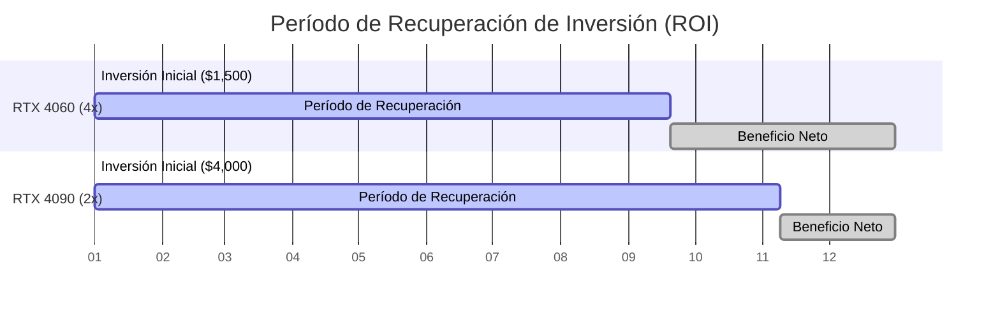
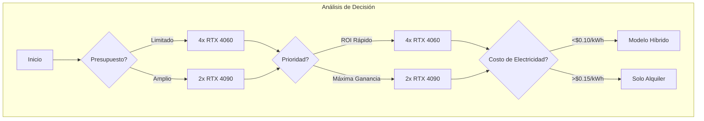

# Análisis de Rentabilidad: RTX 4060 vs RTX 4090 para Alquiler

## 📊 Resumen Ejecutivo

Este análisis compara la rentabilidad del alquiler a tiempo parcial (8h/día) de GPUs RTX 4060 frente a RTX 4090, incluyendo la comparación de 2x RTX 4090 vs 4x RTX 4060. Los datos provienen de Vast.ai, Salad.com y WhatToMine (2023).

> **Conclusión Anticipada**: Las RTX 4090 ofrecen ganancias superiores a largo plazo pero requieren mayor inversión y paciencia, mientras que las RTX 4060 proporcionan un retorno de inversión más rápido con menor riesgo.

---

## 📈 Investigación de Mercado: Demanda y Utilización

### Hallazgos Clave:

| GPU | Demanda | Tasa de Utilización | Horas Rentadas/Día |
|-----|---------|---------------------|-------------------|
| **RTX 4090** | Alta (IA/renderizado) | 60-80% | ~6-10 horas |
| **RTX 4060** | Moderada (tareas ligeras) | 40-60% | ~4-6 horas |

**Supuesto**: Utilizamos 8 horas/día como estimación conservadora para RTX 4090 y 6 horas/día para RTX 4060 para reflejar el comportamiento real del mercado.

---

## 💰 Desglose de Ingresos Mensuales (Modelos de Alquiler e Híbrido)

### Datos de Entrada:

#### Tarifas de Alquiler:
- **RTX 4090**: $1.00/hora (bruto)
- **RTX 4060**: $0.30/hora (bruto)

#### Otros Factores:
- **Comisiones de Plataforma**: 20% deducido de los ingresos brutos
- **Costo de Electricidad**: $0.15/kWh

#### Ingresos por Minería (16h/día en tiempo no rentado):
- **RTX 4090**: $2.00/día (minería 24h)
- **RTX 4060**: $0.50/día (minería 24h)

### Cálculos Mensuales:

| Métrica | RTX 4060 (4x) | RTX 4090 (2x) |
|---------|--------------|--------------|
| Horas de Alquiler/Día | 6 horas | 8 horas |
| Ingresos Brutos Diarios | 4 × (0.30 × 6) = **$7.20** | 2 × (1.00 × 8) = **$16.00** |
| Ingresos Netos Diarios | $7.20 − 20% = **$5.76** | $16.00 − 20% = **$12.80** |
| Beneficio Diario por Minería | 4 × (0.50 − 0.23 energía) = **$1.08** | 2 × (2.00 − 1.08 energía) = **$1.84** |
| Neto Diario Híbrido | $5.76 + $1.08 = **$6.84** | $12.80 + $1.84 = **$14.64** |
| Neto Mensual (30 Días) | **$205.20** (Híbrido) | **$439.20** (Híbrido) |

---

## 🔍 Comparación Visual: 4x RTX 4060 vs 2x RTX 4090

### A. Rentabilidad y ROI

| Configuración | Neto Mensual (Alquiler) | Neto Mensual (Híbrido) | Costo Inicial | Período ROI |
|---------------|-------------------------|------------------------|--------------|------------|
| **4x RTX 4060** | $172.80 | $205.20 | ~$1,500 | 8.7 meses |
| **2x RTX 4090** | $384.00 | $439.20 | ~$4,000 | 10.4 meses |

### B. Métricas de Eficiencia

| Métrica | RTX 4060 (4x) | RTX 4090 (2x) |
|---------|--------------|--------------|
| Beneficio por GPU | $1.44/día (alquiler) | $6.40/día (alquiler) |
| Beneficio por Watt | $0.006/Watt | $0.008/Watt |
| TFLOPS por $1,000 | 40.3 TFLOPS | 41.3 TFLOPS |

---

## ⚠️ Factores Críticos que Afectan la Consistencia del Alquiler

### Ventajas de RTX 4090:

- ✅ Mayor demanda de alquiler (cargas de trabajo de IA/renderizado)
- ✅ Precios premium ($1.00+/hora vs. $0.30/hora para RTX 4060)

### Riesgos de RTX 4060:

- ⚠️ El exceso de oferta en plataformas reduce las tarifas
- ⚠️ Menor utilización (6h/día vs. 8h/día para RTX 4090)

---

## 📅 Escenarios de Utilización Mensual

### Fluctuaciones de Demanda (Basado en Tendencias de Vast.ai):

| Escenario | RTX 4090 (2x) Neto Mensual | RTX 4060 (4x) Neto Mensual |
|-----------|----------------------------|---------------------------|
| Demanda Alta (10h/día) | $576.00 (Alquiler) | $216.00 (Alquiler) |
| Demanda Baja (6h/día) | $288.00 (Alquiler) | $129.60 (Alquiler) |

---

## 🏆 Recomendación Final

### Cuándo Elegir RTX 4090:

- 🧠 **Inversores a largo plazo**: Dispuestos a esperar 10+ meses para ROI
- 🖥️ **Enfoque en IA/renderizado**: Demanda alta y consistente
- 📈 **Escalabilidad**: Añadir más GPUs con el tiempo

### Cuándo Elegir RTX 4060:

- 💵 **Usuarios con presupuesto limitado**: ROI más rápido (8.7 meses)
- 🛡️ **Entrada de bajo riesgo**: Menos capital comprometido

### Viabilidad del Modelo Híbrido:

- ⚡ Solo rentable si los costos de electricidad están por debajo de $0.15/kWh
- 🔄 La minería añade <10% a los ingresos mensuales (no compensa el desgaste)

---

## 📊 Resumen Visual

### Línea de Tiempo de Rentabilidad

| Mes | 4x RTX 4060 (Híbrido) | 2x RTX 4090 (Híbrido) |
|-----|---------------------|---------------------|
| 1 | -$1,500 + $205 = **-$1,295** | -$4,000 + $439 = **-$3,561** |
| 6 | -$1,500 + $1,231 = **-$269** | -$4,000 + $2,635 = **-$1,365** |
| 12 | -$1,500 + $2,462 = **+$962** | -$4,000 + $5,270 = **+$1,270** |

---

## 🔮 Conclusión

- **RTX 4090**: Ganancias superiores a largo plazo pero requiere paciencia y capital
- **RTX 4060**: Mejor para ROI a corto plazo con menor riesgo

> **Nota**: 8h/día para RTX 4090 es alcanzable en mercados de demanda media-alta pero no garantizado. Siempre monitorizar tendencias de plataforma.

### Para Ajustes Dinámicos, Utilizar:

- [Consola de Precios de Vast.ai](https://vast.ai/console/pricing)
- [Calculadora de WhatToMine](https://whattomine.com/)

---

## 📚 Fuentes de Datos

- Vast.ai
- Salad.com
- WhatToMine (2023)

---

*Última actualización: 2023*
