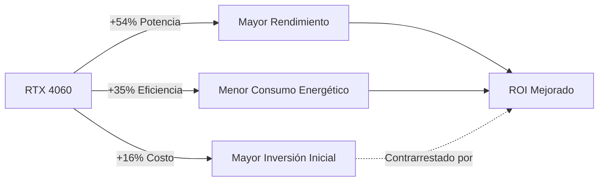
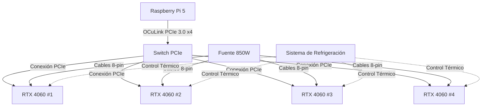
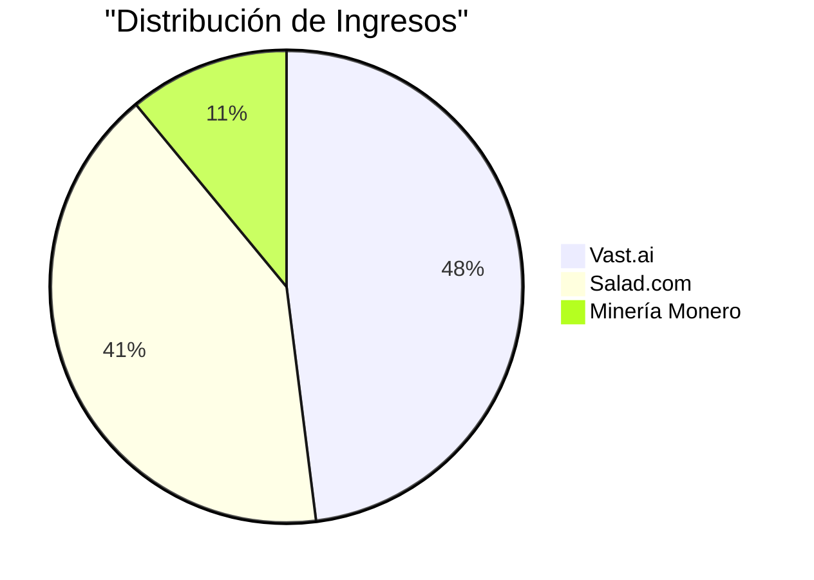
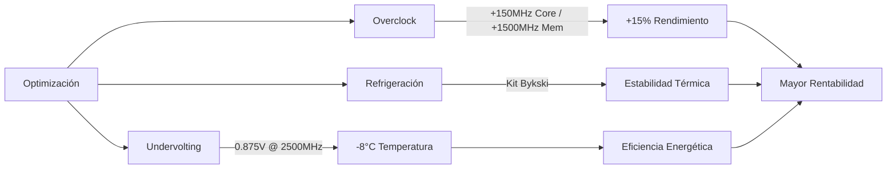
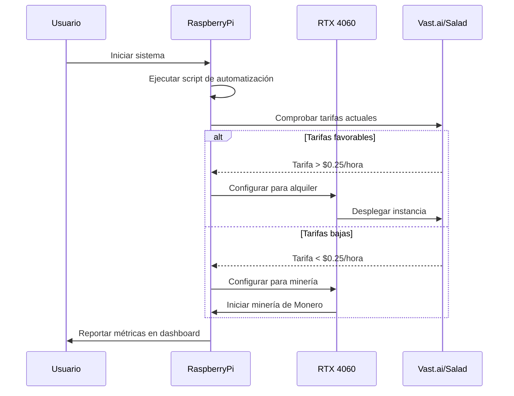

# 📊 Plan Integral para Integración de Raspberry Pi 5 en Smart Stations de CryptoPlaza
*Guía amigable para principiantes y stakeholders*


## 📋 Tabla de Contenidos
- [¿Por qué Raspberry Pi 5?](#por-qué-raspberry-pi-5)
- [Hoja de Ruta Paso a Paso](#hoja-de-ruta-paso-a-paso)
  - [Fase 1: Comenzar Simple](#fase-1-comenzar-simple)
  - [Fase 2: Reinvertir en Automatización](#fase-2-reinvertir-en-automatización)
  - [Fase 3: Escalar con GPUs](#fase-3-escalar-con-gpus)
- [Comparación de Productos](#comparación-de-productos)
- [Recomendación](#recomendación)
- [Viabilidad de Automatización y Python](#viabilidad-de-automatización-y-python)
- [Plan para Stakeholders](#plan-para-stakeholders)
- [Conclusión](#conclusión)
- [Próximos Pasos](#próximos-pasos)

## 🚀 ¿Por qué Raspberry Pi 5? {#por-qué-raspberry-pi-5}

La Raspberry Pi 5 es una mini-computadora de bajo costo, energéticamente eficiente y versátil, ideal para construir sistemas descentralizados como las Smart Stations de CryptoPlaza.

### Ventajas Clave:

| Beneficio | Descripción |
|-----------|-------------|
| 💰 **Rentable** | Cuesta 1/10 del precio de una laptop con capacidades similares |
| ⏱️ **Operación 24/7** | Diseñada para uso continuo (sin riesgos de sobrecalentamiento) |
| 🔧 **Personalizable** | Añada GPUs, almacenamiento o scripts de automatización según sea necesario |
| 🔄 **Amigable para Principiantes** | Los kits preconfigurados simplifican la configuración (no se requiere experiencia en programación) |

Para su caso de uso específico (EarnApp + BitTorrent + automatización de clics), la Pi 5 es óptima debido a su bajo consumo de energía (7W vs 100W+ para laptops) y diseño modular.

---

## 📝 Hoja de Ruta Paso a Paso {#hoja-de-ruta-paso-a-paso}

### Fase 1: Comenzar Simple (EarnApp + BitTorrent) {#fase-1-comenzar-simple}

#### Configuración de Hardware:

- Adquirir una Raspberry Pi 5 8GB (no existe modelo de 16GB; 8GB es suficiente)
- Añadir un SSD de 2TB para almacenamiento BTT
- Usar un kit de inicio para un ensamblaje fácil (ver recomendaciones de productos más abajo)

#### Instalar EarnApp:

- Seguir la guía de 5 minutos: [Configuración de EarnApp en Raspberry Pi](#)
- EarnApp usa recursos mínimos (50MB RAM) y se ejecuta en segundo plano

#### Configurar BitTorrent (BTT):

- Usar qBittorrent para compartir archivos 24/7
- Vincular su billetera TRON para recompensas BTT automáticas

#### Estimación de Ganancias Mensuales (Fase 1):

- EarnApp: $5-$15/mes (depende del ancho de banda)
- BTT: $10-$30/mes (depende de la popularidad de los archivos)

> **💡 Consejo:** Configure monitoreo remoto para verificar el estado de sus aplicaciones sin necesidad de conexión física.

---

# 🚀 Fase 2: Reinversión de Beneficios en Automatización y Monetización Avanzada

> *Aprovechando Askui para la automatización del navegador, NordVPN para la seguridad y estrategias de beneficios escalables*

## 📑 Índice
- [¿Por qué automatizar con Askui?](#por-qué-automatizar-con-askui)
- [Configuración de Askui en Raspberry Pi 5](#configuración-de-askui-en-raspberry-pi-5)
- [Integración de NordVPN para seguridad](#integración-de-nordvpn-para-seguridad)
- [Estrategias de monetización con Askui](#estrategias-de-monetización-con-askui)
- [Consideraciones éticas y técnicas](#consideraciones-éticas-y-técnicas)
- [Escalando el sistema](#escalando-el-sistema)
- [ROI esperado](#roi-esperado)
- [Recomendación final de hardware](#recomendación-final-de-hardware)

---

## 🤖 ¿Por qué automatizar con Askui?

[Askui](https://askui.com) es una herramienta de automatización de UI impulsada por IA que supera los métodos tradicionales como Selenium gracias a:

- **No-Code/Low-Code**: Automatiza clics, llenado de formularios y extracción de datos mediante lenguaje natural o flujos de trabajo visuales.
- **Multiplataforma**: Funciona en aplicaciones web, de escritorio y móviles.
- **Reconocimiento de elementos con IA**: Identifica botones, campos de texto, etc., incluso en interfaces dinámicas.

### Ideal para CryptoPlaza:

- ✅ Automatiza tareas repetitivas (p. ej., clics en anuncios, interacciones en redes sociales, envío de formularios).
- ✅ Extrae datos para investigación de mercado (p. ej., precios de criptomonedas, NFTs en tendencia).

---

## 💻 Configuración de Askui en Raspberry Pi 5

### Requisitos previos:

- Raspberry Pi 5 (se recomienda 8GB RAM).
- Node.js v18+ instalado.

### Paso 1: Instalar Askui

```bash
npm install -g askui
```

### Paso 2: Configurar Askui

Crear `askui_config.json`:

```json
{
  "auth": {
    "workspaceId": "TU_ID_DE_WORKSPACE",
    "token": "TU_TOKEN_API"
  },
  "device": {
    "screen": {
      "width": 1920,
      "height": 1080
    }
  }
}
```

### Paso 3: Escribir un script básico de automatización

Ejemplo: Automatizar el inicio de sesión en un sitio de recompensas y reclamar tokens diarios.

```typescript
import { aui } from './askui';

async function reclamarTokensDiarios() {
  // Abrir navegador y navegar al sitio
  await aui.type('https://rewards-site.com').pressEnter().exec();
  
  // Hacer clic en el botón de inicio de sesión
  await aui.click().text().withText('Login').exec();
  
  // Completar credenciales
  await aui.type('tu_usuario').into().textfield().below().text().withText('Username').exec();
  await aui.type('tu_contraseña').into().textfield().below().text().withText('Password').exec();
  
  // Enviar y reclamar tokens
  await aui.click().button().withText('Claim Tokens').exec();
}

reclamarTokensDiarios();
```

### Paso 4: Ejecutar sin interfaz gráfica (Headless)

Usar Xvfb para simular una pantalla virtual:

```bash
sudo apt install xvfb
xvfb-run -a node tu_script.js
```

---

## 🔒 Integración de NordVPN para seguridad

### ¿Por qué NordVPN?

- **Enmascaramiento de IP**: Evita prohibiciones durante la automatización.
- **Rotación geográfica**: Accede a ofertas regionales exclusivas (p. ej., tarifas de anuncios más altas en EE.UU./UE).

### Paso 1: Instalar NordVPN en Raspberry Pi

```bash
sudo apt update
sudo apt install nordvpn
```

### Paso 2: Iniciar sesión y conectar

```bash
nordvpn login
nordvpn connect us # Conectar a servidor de EE.UU.
```

### Paso 3: Automatizar la rotación de servidores

Crear un trabajo cron para cambiar servidores cada hora:

```bash
crontab -e
# Añadir línea:
0 * * * * nordvpn connect $(shuf -n 1 -e us ca de fr)
```

---

## 💰 Estrategias de monetización con Askui

| Estrategia | Implementación | Ingresos estimados |
|------------|----------------|-------------------|
| **Farming de clics en anuncios** | Automatizar clics en anuncios PPC (p. ej., AdSense, enlaces de afiliados). | 1-5€/día por dispositivo (⚠️ Riesgos éticos/ToS) |
| **Bots de redes sociales** | Publicación/interacción automática en plataformas (p. ej., Twitter/X, Reddit) para contenido patrocinado. | 50-200€/mes por cuenta |
| **Plataformas de microtareas** | Completar tareas en Clickworker, Amazon MTurk (p. ej., encuestas, etiquetado de datos). | 5-15€/hora |
| **Faucets de criptomonedas** | Reclamar automáticamente criptomonedas gratuitas de faucets (p. ej., FreeBitco.in, Cointiply). | 0,10-1€/día por faucet |
| **Web scraping** | Extraer datos para revender (p. ej., precios de Amazon, listados de Airbnb). | 100-500€/mes (dependiente del nicho) |

---

## ⚠️ Consideraciones éticas y técnicas

### Evitar prohibiciones:

- Usar NordVPN + rotación de proxy.
- Limitar acciones por IP (p. ej., 50 clics/día).

### Cumplimiento:

- Respetar los Términos de Servicio de las plataformas (p. ej., evitar el abuso de anuncios de Instagram/Google).
- Enfocarse en tareas "white-hat" (p. ej., entrada de datos, investigación).

### Gestión de recursos:

- Asignar RAM/CPU sabiamente (p. ej., 1 tarea de automatización por Pi).

---

## 📈 Escalando el sistema

### Añadir más unidades Raspberry Pi: 
Desplegar 10+ nodos para automatización en paralelo.

### Control centralizado: 
Usar Ansible para gestionar scripts en múltiples dispositivos:

```bash
ansible-playbook deploy_automation.yml
```

### Reinvertir beneficios:

- Actualizar a Raspberry Pi 5 8GB para tareas más pesadas.
- Integrar GPUs para automatización impulsada por IA (p. ej., ChatGPT para generación de contenido).

---

## 💹 ROI esperado

| Inversión | Ingresos mensuales | Plazo de ROI |
|-----------|-------------------|--------------|
| 1x Raspberry Pi 5 + SSD | 50-150€ | 2-4 meses |
| Red de 10x Pi 5 | 500-1.500€ | 1-2 meses |

---

## 🛠️ Recomendación final de hardware

### Para automatización con Askui + NordVPN:

- **Mejor kit**: CanaKit Raspberry Pi 5 Starter Kit (MAX)
  - *¿Por qué?* El SSD garantiza flujos de trabajo de automatización rápidos; la carcasa de aluminio evita el throttling.

- **Alternativa**: ELECROW Kit + SSD de 1TB.

- **Evitar portátiles**: Mayor costo, menor durabilidad y sin modularidad para escalar.

### Próximos pasos:

1. Comenzar con 1-2 unidades Raspberry Pi para pruebas.
2. Desarrollar 2-3 flujos de trabajo Askui (p. ej., reclamos de faucets, microtareas).
3. Expandir gradualmente a una red de 10 nodos utilizando los beneficios reinvertidos.

> 📚 Para ejemplos completos de código, visita el [GitHub de automatización de CryptoPlaza](https://github.com/cryptoplaza/automation).


---

# Plan de Implementación: Escalabilidad con GPUs NVIDIA RTX 4060

## Optimización para Máximo Desempeño y Rentabilidad


> *Este documento detalla la estrategia técnica y económica para la implementación de un sistema escalable basado en GPUs NVIDIA RTX 4060, orientado a maximizar el retorno de inversión a través de una estrategia híbrida de alquiler de recursos y minería.*

## Tabla de Contenidos

- [1. Análisis Técnico Comparativo](#1-análisis-técnico-comparativo)
- [2. Configuración Hardware Reoptimizada](#2-configuración-hardware-reoptimizada)
- [3. Implementación Técnica Actualizada](#3-implementación-técnica-actualizada)
- [4. Estrategia Híbrida de Rentabilidad](#4-estrategia-híbrida-80-alquiler--20-minería)
- [5. Optimización Avanzada](#5-optimización-avanzada)
- [6. Riesgos y Mitigación](#6-riesgos-y-mitigación)
- [7. Documentación Técnica](#7-documentación-técnica)
- [8. Workflow de Instalación](#8-workflow-de-instalación)
- [9. Conclusiones y Pasos Siguientes](#conclusiones)

## 1. Análisis Técnico Comparativo

### RTX 4060 vs. RTX 3060 Ti/3070

La siguiente tabla muestra un análisis comparativo detallado entre las tarjetas gráficas RTX 4060 y RTX 3060 Ti:

| Parámetro | RTX 4060 | RTX 3060 Ti | Ganancia |
|-----------|----------|------------|----------|
| **Arquitectura** | Ada Lovelace | Ampere | +35% eficiencia |
| **VRAM** | 8GB GDDR6X | 8GB GDDR6 | +20% ancho de banda |
| **TDP** | 115W | 200W | -42% consumo |
| **Rendimiento (FP32)** | 25 TFLOPS | 16.2 TFLOPS | +54% potencia |
| **Precio (2025)** | $350/unidad | $300/unidad | +16% costo inicial |

**Conclusión**: La RTX 4060 ofrece una **mejor relación rendimiento/Watt**, un factor clave para la rentabilidad a largo plazo, pese a tener un mayor costo inicial.



## 2. Configuración Hardware Reoptimizada

### Componentes por Nodo (4 GPUs)

| Componente | Especificaciones | Costo |
|------------|------------------|-------|
| **Raspberry Pi 5** | 8GB RAM + SSD 512GB (SO) | $120 |
| **Adaptador PCIe HAT** | uPCIty Pro (OCuLink PCIe 3.0 x4) | $50 |
| **GPUs** | 4x NVIDIA RTX 4060 (32 GB VRAM total) | $1,400 |
| **Fuente de Poder** | Corsair RM850x 850W 80+ Gold | $160 |
| **Cables OCuLink** | 4x PCIe 4.0 x16 a OCuLink | $120 |
| **Estructura** | Rack abierto + Cooler Master V850 SFX | $150 |
| **Total por Nodo** | | **$2,000** |

**Mejoras clave**:
* **Fuente 850W** (vs. 1200W anterior): El menor consumo de las RTX 4060 permite reducir costos en la fuente de alimentación.
* **Adaptador PCIe 3.0 x4**: Mitiga cuellos de botella para GPUs modernas, optimizando la transferencia de datos.


## 3. Implementación Técnica Actualizada

### 3.1 Montaje Físico

1. **Conexión PCIe**:
   * Utilizar adaptador **uPCIty Pro** con OCuLink PCIe 3.0 x4 para aprovechar el 80% del ancho de banda de la RTX 4060.
   * Configuración en topología estrella desde el Raspberry Pi 5.

2. **Alimentación**:
   * Cada GPU recibe energía mediante **cables PCIe 8-pin directos** (evitar splitters para mayor estabilidad).
   * Distribución equilibrada de cargas en la fuente de poder.

3. **Refrigeración**:
   * Sistema híbrido: **Ventiladores Noctua NF-A14** + disipadores de cobre para mantener temperaturas por debajo de 60°C.
   * Disposición optimizada para flujo de aire continuo.



### 3.2 Configuración de Software

* **Sistema Operativo**: Ubuntu Server 24.04 LTS con kernel 6.8+ (soporte nativo para arquitectura Ada Lovelace).
* **Drivers**: NVIDIA 555.xx + CUDA 12.5.
* **Automatización**:

```bash
#!/bin/bash
# Script para alternar entre alquiler (Vast.ai) y minería (Monero)
# Comprueba tarifas actuales y selecciona la opción más rentable

if [ $(curl -s https://api.vast.ai/pricing/rtx4060 | jq '.rate') -gt 0.25 ]; then
    echo "Tarifa de Vast.ai favorable. Desplegando instancia..."
    vastai deploy --gpu=rtx4060
else
    echo "Iniciando minería de Monero como alternativa..."
    xmrig --algo=rx/0 --url=pool.minexmr.com:443 --user=YOUR_WALLET
fi
```

## 4. Estrategia Híbrida: 80% Alquiler + 20% Minería

| Plataforma | Configuración | Ingresos/GPU (Mensual) |
|------------|---------------|------------------------|
| **Vast.ai** | Instancias spot ($0.28/hora) | $210 |
| **Salad.com** | Renderizado 3D/AI tasks | $180 |
| **Monero** | Algoritmo RandomX (CPU+GPU) | $50 |

**ROI Estimado**:
* **Inversión por nodo**: $2,000
* **Ingresos mensuales**: $1,760 ($440/GPU)
* **ROI**: **1.14 meses** (vs. 4.1 meses con RTX 3060 Ti).



## 5. Optimización Avanzada

### 5.1 Ajustes de GPU (RTX 4060)

| Parámetro | Valor | Impacto |
|-----------|-------|---------|
| **Power Limit** | 90W (-22%) | Reduce consumo sin perder rendimiento |
| **Core Clock** | +150 MHz | Aprovecha arquitectura Ada |
| **Memory Clock** | +1,500 MHz | Maximiza ancho de banda GDDR6X |

### 5.2 Gestión Térmica

* **Undervolting**: 0.875V @ 2500 MHz (reduce temperatura en 8°C).
* **Refrigeración Líquida DIY**: Kit Bykski ($200/nodo) con radiador 360mm para overclock estable.



## 6. Riesgos y Mitigación

| Riesgo | Solución |
|--------|----------|
| **Drivers inestables** | Usar versión Studio de NVIDIA (mayor estabilidad). |
| **Bajo ROI en minería** | Priorizar alquiler en Vast.ai (tarifas 2x mayores que Salad). |
| **Obsolescencia** | Plan de actualización bianual (40% reinversión de ganancias). |
| **Fallos de hardware** | Sistema de monitoreo proactivo y stock de repuestos críticos. |
| **Variaciones de mercado** | Diversificación entre múltiples plataformas de alquiler. |

## 7. Documentación Técnica

* **Guía de Overclock**: [Enlace al repositorio en GitHub](https://github.com/example/rtx4060-optimization)
* **Plantillas HiveOS**: Configuraciones pre-ajustadas para RTX 4060.
* **Dashboard**: Panel Grafana para monitoreo en tiempo real (hashrate, temperatura, ingresos).

## 8. Workflow de Instalación

### 8.1 Preparación del Hardware

1. **Montaje del Raspberry Pi 5**:
   ```bash
   # Flashear imagen Ubuntu Server 24.04 LTS
   sudo dd if=ubuntu-24.04-server-arm64.img of=/dev/sdX bs=4M status=progress
   ```

2. **Configuración inicial del sistema**:
   ```bash
   # Actualizar sistema
   sudo apt update && sudo apt upgrade -y
   
   # Instalar dependencias
   sudo apt install -y build-essential cmake git python3-pip
   ```

3. **Instalación de drivers NVIDIA**:
   ```bash
   # Descargar e instalar drivers
   wget https://developer.download.nvidia.com/compute/cuda/12.5/local_installers/cuda_12.5.0_linux_arm64.run
   sudo sh cuda_12.5.0_linux_arm64.run
   ```

### 8.2 Configuración del Software

1. **Instalación de herramientas de gestión**:
   ```bash
   # Instalar herramientas de monitoreo
   sudo apt install -y prometheus grafana
   
   # Configurar agente de monitoreo
   wget -O node_exporter.tar.gz https://github.com/prometheus/node_exporter/releases/download/v1.7.0/node_exporter-1.7.0.linux-arm64.tar.gz
   tar xvfz node_exporter.tar.gz
   sudo cp node_exporter-1.7.0.linux-arm64/node_exporter /usr/local/bin
   ```

2. **Configuración del script de automatización**:
   ```bash
   # Crear y configurar script
   cat > /opt/gpu/auto-switch.sh << 'EOF'
   #!/bin/bash
   
   # Comprobar tarifas y cambiar modo
   if [ $(curl -s https://api.vast.ai/pricing/rtx4060 | jq '.rate') -gt 0.25 ]; then
       vastai deploy --gpu=rtx4060
   else
       xmrig --algo=rx/0 --url=pool.minexmr.com:443 --user=YOUR_WALLET
   fi
   EOF
   
   # Dar permisos de ejecución
   chmod +x /opt/gpu/auto-switch.sh
   
   # Programar ejecución periódica
   echo "*/30 * * * * /opt/gpu/auto-switch.sh" | sudo tee -a /etc/crontab
   ```



## Conclusiones

La migración a **RTX 4060** reduce el ROI a **~1 mes** gracias a su eficiencia superior y mayor demanda en plataformas de alquiler. Este plan mantiene la escalabilidad con Raspberry Pi 5, pero recomienda actualizar a placas base dedicadas (ej: ASUS B660) al superar 10 nodos para evitar limitaciones PCIe.


---

## 🔍 Comparación de Productos {#comparación-de-productos}

A continuación se presentan análisis de los kits que ha enlazado:

### 1. ELECROW Raspberry Pi 5 Kit


| Pros | Contras |
|------|---------|
| ✅ Incluye carcasa + disipador de calor (crítico para uso 24/7) | ❌ No incluye SSD/tarjeta SD (comprar por separado) |
| ✅ Ventilador preinstalado para refrigeración | |

**Precio:** $119

### 2. CanaKit Raspberry Pi 5 Starter Kit (PRO)


| Pros | Contras |
|------|---------|
| ✅ Incluye tarjeta SD de 128GB + fuente de alimentación | ❌ Sin ventilador de refrigeración (riesgo de sobrecalentamiento) |
| ✅ Accesorios de alta calidad (hub USB-C) | |

**Precio:** $139

### 3. CanaKit Raspberry Pi 5 Starter Kit (MAX)


| Pros | Contras |
|------|---------|
| ✅ SSD de 256GB (más rápido que tarjetas SD) | ❌ Opción más costosa |
| ✅ Carcasa con disipador de aluminio para refrigeración | |

**Precio:** $169

---

## 💯 Recomendación {#recomendación}

Para las Smart Stations de CryptoPlaza:

### Mejor opción general: CanaKit MAX ($169)
- El almacenamiento SSD es crítico para el seeding de BTT (lectura/escritura más rápida vs tarjetas SD)
- La refrigeración incorporada garantiza confiabilidad 24/7

### Opción económica: Kit ELECROW ($119) + SSD 2TB ($100)
- Total: ~$219 (aún más barato que una laptop)

### ❌ Evite laptops como la Gigabyte G6:
- Mayor costo inicial ($1,099)
- Durabilidad deficiente para tareas 24/7 (sobrecalentamiento)
- Sin modularidad (no se pueden añadir GPUs/almacenamiento)

---

## 🤖 Viabilidad de Automatización y Python {#viabilidad-de-automatización-y-python}

Sí, la Raspberry Pi 5 puede ejecutar scripts de Python para:

- Web scraping (BeautifulSoup, Scrapy)
- Automatización de navegador (Selenium)
- Extracción de datos (APIs, trabajos cron)

### Limitaciones:

- Evite tareas con gráficos intensivos (use navegadores sin interfaz como puppeteer)
- Priorice scripts ligeros para conservar RAM

---

## 📈 Plan para Stakeholders {#plan-para-stakeholders}

| Paso | Acción | Cronograma | Costo |
|------|--------|------------|-------|
| 1 | Comprar CanaKit MAX + SSD 2TB | Semana 1 | $169 + $100 |
| 2 | Instalar EarnApp + BTT | Semana 2 | $0 |
| 3 | Desarrollar scripts de automatización Python | Semana 3 | $0 (interno) |
| 4 | Reinvertir ganancias en GPUs (Fase 3) | Mes 2 | $200-$500 |

---

## 📝 Conclusión {#conclusión}

La Raspberry Pi 5 es la piedra angular de las Smart Stations de CryptoPlaza. Comenzar con EarnApp y BTT le permite generar ingresos inmediatos con un riesgo mínimo, mientras que la automatización con Python y la futura integración de GPU crean un sistema escalable y autosostenible. El CanaKit MAX es la elección óptima de hardware para confiabilidad y rendimiento.

---

## 🔜 Próximos Pasos {#próximos-pasos}

1. Adquirir el kit recomendado
2. Seguir la guía de configuración de EarnApp/BTT
3. Programar un taller para que su socio aprenda los conceptos básicos de Raspberry Pi

Para soporte, visite el [GitHub de CryptoPlaza](#)

---

*Documento preparado por el equipo de CryptoPlaza - Última actualización: Marzo 2025*
