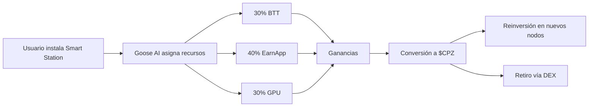

# Smart Stations de CryptoPlaza
## Nodos Descentralizados para la Economía FinTech 3.0
### *Integración de Almacenamiento, Ancho de Banda y GPU en un Modelo Autogestionable*

---

## 📋 Tabla de Contenidos
- [1. Resumen Ejecutivo](#1-resumen-ejecutivo)
- [2. Arquitectura Técnica](#2-arquitectura-técnica)
- [3. Modelo de Negocio](#3-modelo-de-negocio)
- [4. Implementación y Roadmap](#4-implementación-y-roadmap)
- [5. Ventajas Competitivas](#5-ventajas-competitivas)
- [6. Seguridad y Cumplimiento](#6-seguridad-y-cumplimiento)
- [7. Equipo y Alianzas](#7-equipo-y-alianzas)
- [8. Proyección Financiera](#8-proyección-financiera)
- [9. Conclusión y Visión](#9-conclusión-y-visión)

---

## 1. Resumen Ejecutivo

**Smart Stations** son nodos físicos o virtuales que combinan recursos computacionales (almacenamiento, ancho de banda, GPU) para generar ingresos pasivos mediante protocolos P2P y algoritmos de inteligencia artificial. 

Diseñadas para democratizar el acceso a la tokenización de recursos, estas estaciones operan bajo el ecosistema CryptoPlaza, permitiendo a usuarios individuales y empresas:

- 💰 **Monetizar recursos inactivos**
- 🌐 **Participar en redes descentralizadas** (BitTorrent, EarnApp, GPU sharing)
- 🪙 **Ganar tokens** $CPZ (gobernanza) y BTT (monetización directa)

---

## 2. Arquitectura Técnica

### 2.1 Componentes Clave

| **Capa** | **Tecnologías** | **Función** |
|:--------:|:---------------:|:------------|
| **Hardware** | Raspberry Pi 5, SSD 1TB+, GPU NVIDIA/AMD | Base física para almacenamiento y cómputo |
| **Software** | Docker, qBittorrent, EarnApp CLI | Gestión de recursos y conexión a redes P2P |
| **Blockchain** | BSC (BEP-20), TRON (TRC-20) | Tokenización y transacciones on-chain |
| **IA** | Goose AI (optimización), Maverick (trading) | Automatización y maximización de ganancias |

### 2.2 Flujo de Operaciones

---

## 3. Modelo de Negocio

### 3.1 Fuentes de Ingresos

| **Recurso** | **Plataforma** | **Ganancias Promedio/Nodo (Mensual)** |
|:------------|:---------------|:--------------------------------------|
| **Almacenamiento (BTT)** | BitTorrent Speed | 15-30 USD |
| **Ancho de Banda** | EarnApp + Bright SDK | 10-25 USD |
| **GPU** | Vast.ai, Salad.com | 20-60 USD |

### 3.2 Tokenización con $CPZ

- 🎁 **Recompensas Diarias:** 5 CPZ por nodo activo (aprox. 0.50 USD diarios con valor inicial de $0.10 por token)
- 🔒 **Staking:** 15% APY por bloquear $CPZ en la app CryptoPlaza
- 🔥 **Quema Semanal:** 1% de las ganancias totales se destina a reducir el suministro

---

## 4. Implementación y Roadmap

### 4.1 Fases de Despliegue

| **Fase** | **Hito** | **Fecha** |
|:---------|:---------|:----------|
| **Piloto** | 100 nodos en Latinoamérica (MVP) | Q4 2024 |
| **Escalado** | Integración con BSC Mainnet | Q1 2025 |
| **Global** | 10,000 nodos operativos + DAO activa | Q4 2025 |

### 4.2 Integración con Otras Redes

- 📦 **Almacenamiento Descentralizado:** IPFS para backups seguros de metadatos
- 🔮 **Oráculos:** Chainlink para precios en tiempo real de BTT y $CPZ

---

## 5. Ventajas Competitivas

### 5.1 Eficiencia Energética

- ⚡ **Consumo:** 5W por nodo (vs. 500W de un rig de minería tradicional)
- ♻️ **Hardware Reciclable:** Uso de Raspberry Pi y routers reacondicionados

### 5.2 Interfaz de Usuario (UI/UX)

- 📊 **Dashboard Unificado:** Visualización de métricas en tiempo real:
  - Ganancias por recurso
  - Salud del hardware (temperatura, uso de RAM)
  - Conversión directa a stablecoins
- 📱 **App Móvil:** Notificaciones push y control remoto de nodos

---

## 6. Seguridad y Cumplimiento

### 6.1 Protocolos

- 🔐 **Cifrado:** AES-256 para datos en tránsito y reposo
- 🛡️ **VPN Integrada:** Conexiones seguras mediante WireGuard
- 🔍 **Auditorías:** Contratos inteligentes revisados por CertiK

### 6.2 Marco Legal

- 📝 **KYC/AML:** Requerido para transacciones >$1,000 USD
- 🏆 **Certificaciones:** CE/FCC para dispositivos comerciales

---

## 7. Equipo y Alianzas

### Equipo Fundador:

- 👨‍💼 **CEO:** Experiencia en infraestructura blockchain (ex-AWS)
- 👩‍💻 **CTO:** Especialista en redes P2P y ciberseguridad

### Socios Estratégicos:

- 🤝 **Binance Smart Chain:** Liquidez y soporte técnico
- 🤝 **Bright SDK:** Optimización de tráfico y monetización

---

## 8. Proyección Financiera

| **Año** | **Nodos Activos** | **Ingresos Anuales (USD)** | **Valoración $CPZ** |
|:--------|:------------------|:---------------------------|:--------------------|
| **2025** | 5,000 | $1.8M | $0.25 |
| **2026** | 50,000 | $18M | $0.80 |
| **2027** | 200,000 | $72M | $1.50 |

---

## 9. Conclusión y Visión

Las Smart Stations representan un paradigma en la economía descentralizada, fusionando hardware accesible, tokenización sostenible y automatización impulsada por IA. Este modelo no solo genera flujos de ingresos pasivos, sino que construye una red global de recursos compartidos, impulsando la visión FinTech 3.0 de CryptoPlaza.

---

## 🚀 Únete a la Revolución

- [Comprar Kit Smart Station](https://shop.cryptoplaza.io)
- [Documentación Técnica](https://github.com/CryptoPlazaHQ/Stock)
- [Soporte](mailto:soporte@cryptoplaza.io)

---

> **Descargo de Responsabilidad:**  
> Este documento es informativo y no constituye asesoría financiera. Los rendimientos pueden variar según condiciones de mercado.

---

  
© 2025 CryptoPlaza. Todos los derechos reservados.

  

    <a href="https://twitter.com/cryptoplaza">Twitter</a> •
    <a href="https://t.me/cryptoplaza">Telegram</a> •
    <a href="https://discord.gg/cryptoplaza">Discord</a>
  

