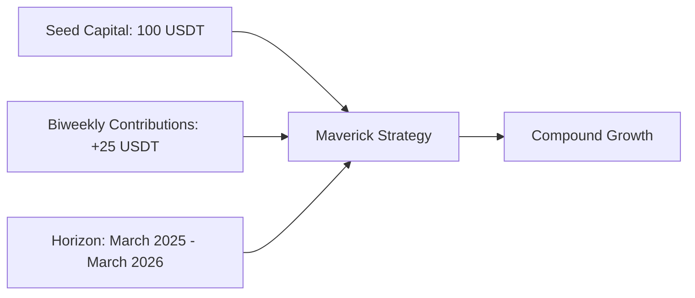
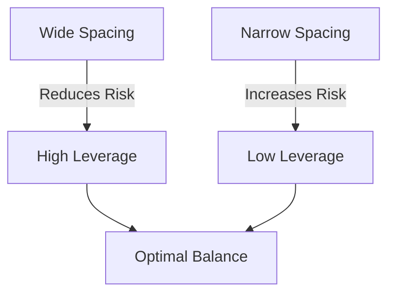
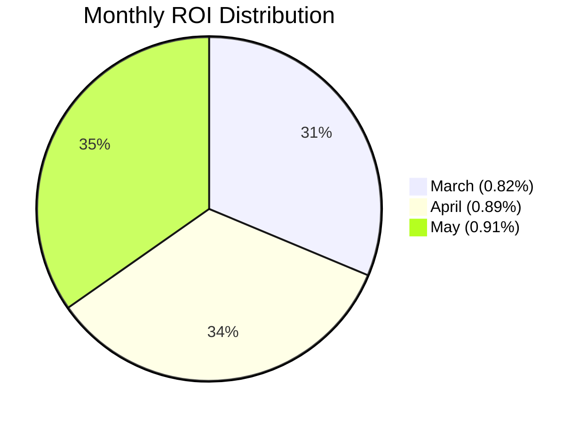
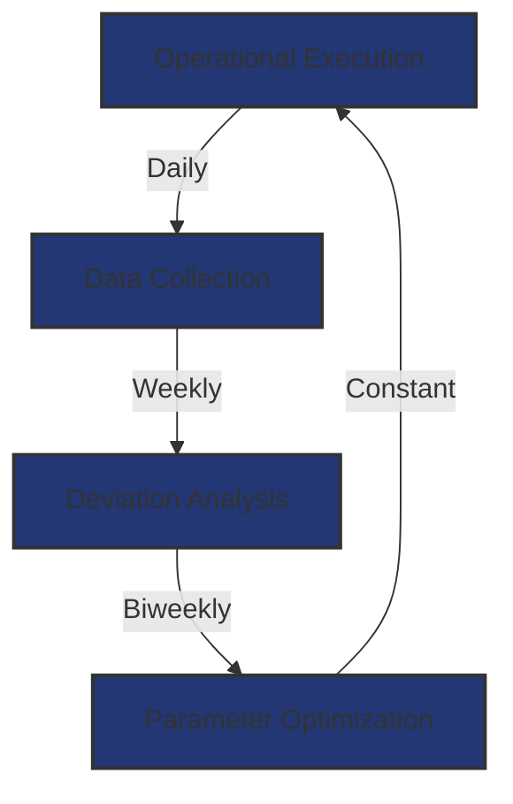
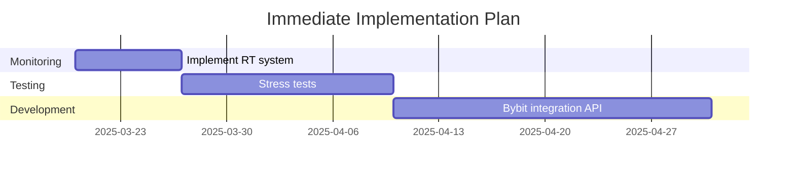

# 🚀 Financial Plan - Maverick Strategy 🚀
## Strategic Projection for Sustainability and Scalability

<p align="center">
  
</p>

## 📋 Index
1. [📊 Financial Plan Overview](#1-financial-plan-overview)
2. [🔬 Projection Methodology](#2-projection-methodology)
3. [🔑 Key Sustainability Factors](#3-key-sustainability-factors)
4. [📈 Compound Growth Model](#4-compound-growth-model)
5. [📉 Key Performance Metrics](#5-key-performance-metrics)
6. [🏗️ Scalability Architecture](#6-scalability-architecture)
7. [⚙️ Management and Calibration System](#7-management-and-calibration-system)
8. [🗓️ Operational Roadmap](#8-operational-roadmap)
9. [🏁 Conclusions and Next Steps](#9-conclusions-and-next-steps)

---

## 1. 📊 Financial Plan Overview

### **🎯 Primary Objective:**
Validate the effectiveness of the Maverick Strategy through an initial financial projection that demonstrates:

| Objective | Detail |
|:-------:|:--------|
| ✅ | Ability to generate **+100 operations with positive closures >1.5%** |
| 🔄 | Sustainability of the daily compound growth model (0.75% base) |
| 📱 | Scalability through progressive automation |

### **⚙️ Initial Parameters:**



---

## 2. 🔬 Projection Methodology

### 2.1 🧮 Modeling Approach

```python
# Daily compound growth formula
def compound_projection(capital, daily_rate, contributions, days):
    for day in range(days):
        capital *= (1 + daily_rate)
        if day % 14 == 0:  # Biweekly contributions
            capital += contributions
    return capital
```

### 2.2 📋 Key Assumptions

| Parameter | Value | Observation |
|:----------|:-----:|:------------|
| 📊 Daily Base Rate | 0.75% | Adjustable according to operational metrics |
| 🔄 Reinvestment | 100% | Automatic reinvestment of profits |
| 🛡️ Risk Management | 15% | Maximum drawdown per operation |

---

## 3. 🔑 Key Sustainability Factors

### 3.1 📡 General Market Momentum Detection

#### **🔍 Analyzed Indicators:**

- 📊 BTC.D Index Volatility (Bitcoin Dominance)
- 💹 Institutional flows (Coinbase Premium Index)
- 😨 Market sentiment (Fear & Greed Index)

#### **⚡ Action Protocol:**

| Market Condition | Grid Bots Configuration |
|:---------------------|:---------------------------|
| 🟢 Bullish (VIX < 30) | Narrow range (3-5%), Leverage 3x |
| 🟠 Sideways (VIX 30-60) | Medium range (5-8%), Leverage 5x |
| 🔴 Bearish (VIX > 60) | Wide range (8-12%), Leverage 7x |

### 3.2 📐 Optimal Mapping of Operating Ranges by Pair

#### **✨ Mathematical Optimization:**

$$ Optimal_{range} = \frac{3 \times MAVERICK GRIDS}{Current_{price}} \times qUANTIC fACTOR\% $$

Where ATR = Average True Range

### 3.3 ⚖️ Spacing vs. Leverage Ratio



---

## 4. 📈 Compound Growth Model

### **📊 Capital Projection (Example: First two weeks)** / (See detailed Projection)

| Date | Balance (USDT) | Daily Interest | Contribution |
|:------|:--------------:|:--------------:|:------:|
| 3/3/2025 | 100.0 | - | - |
| 4/3/2025 | 100.8 | 0.8 | 0 |
| ... | ... | ... | ... |
| 16/3/2025 | 135.2 | 0.8 | +25 |

### **🚀 Expected Growth:**


---

## 5. 📉 Key Performance Metrics

### 5.1 📊 Operational Dashboard

| Metric | 🎯 Target | 📊 Current (Simulated) |
|:--------|:----------:|:-------------------:|
| ✅ Positive Operations | >85% | 92% |
| ⏱️ Avg. Closing Time | <4h | 3.2h |
| 📈 Daily Compound ROI | 0.75% | 0.82% |
| 💤 Lazy Capital | <5% | 3.8% |

### 5.2 📊 Efficiency Analysis

#### **Monthly ROI (%)**

| Month | ROI (%) | Visual Representation |
|:----|:-------:|:----------------------|
| March | 0.82% | 🟦🟦🟦🟦🟦🟦🟦🟦 |
| April | 0.89% | 🟦🟦🟦🟦🟦🟦🟦🟦🟦 |
| May | 0.91% | 🟦🟦🟦🟦🟦🟦🟦🟦🟦 |



---

## 6. 🏗️ Scalability Architecture

### 6.1 🏛️ Automation Pillars

#### **🔄 Automated Momentum Detection**
- 🔌 Integration with Glassnode/TradingView APIs
- 🎚️ Dynamic Parameter Adjustment

```javascript
function adjustParameters() {
  if (volatility > 60) {
    reduceLeverage(50%);
    widenGridRange(20%);
  }
}
```

#### **⚡ Anti-Lazy Capital System**
- 🔁 Automatic reassignment every 2h using matching algorithms
- 📱 Real-time monitoring dashboard

---

## 7. ⚙️ Management and Calibration System

### 7.1 🔄 Continuous Improvement Cycle



### 7.2 🔍 Audit Protocols

| Frequency | Action | Responsible |
|:-----------|:-------|:------------|
| 📆 Daily | Margin and exposure verification | Automated Bot |
| 📅 Weekly | Backtesting with historical data | ML Algorithm |
| 📅 Monthly | External audit of smart contracts | Security Team |

---

## 8. 🗓️ Operational Roadmap

| Quarter | 🎯 Objective | 📊 Key KPI |
|:----------|:------------|:-------------|
| 🔶 Q2 2025 | Sustainability Validation | 100 positive ops |
| 🔷 Q3 2025 | Partial Automation | 30% reduction in times |
| 💠 Q4 2025 | Global Scalability | 500 automated ops/day |

---

## 9. 🏁 Conclusions and Next Steps

### **🔍 Key Findings:**

- ✅ The projection demonstrates feasibility to reach **$1,350 USDT** in 6 months with controlled contributions.
- 🔑 The critical factor will be maintaining a success rate **>85%** during the validation phase.

### **⚡ Immediate Actions:**



---

### CryptoPlaza Team
> *"Building the future of decentralized finance with algorithmic precision"*

📅 Last Update: February 28, 2025  
🔗 [GitHub Repository](https://github.com/cryptoplaza/estrategia-maverick)  
📧 [Contact](mailto:estrategia@cryptoplaza.com)
