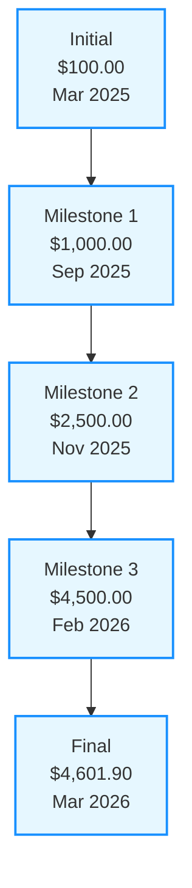
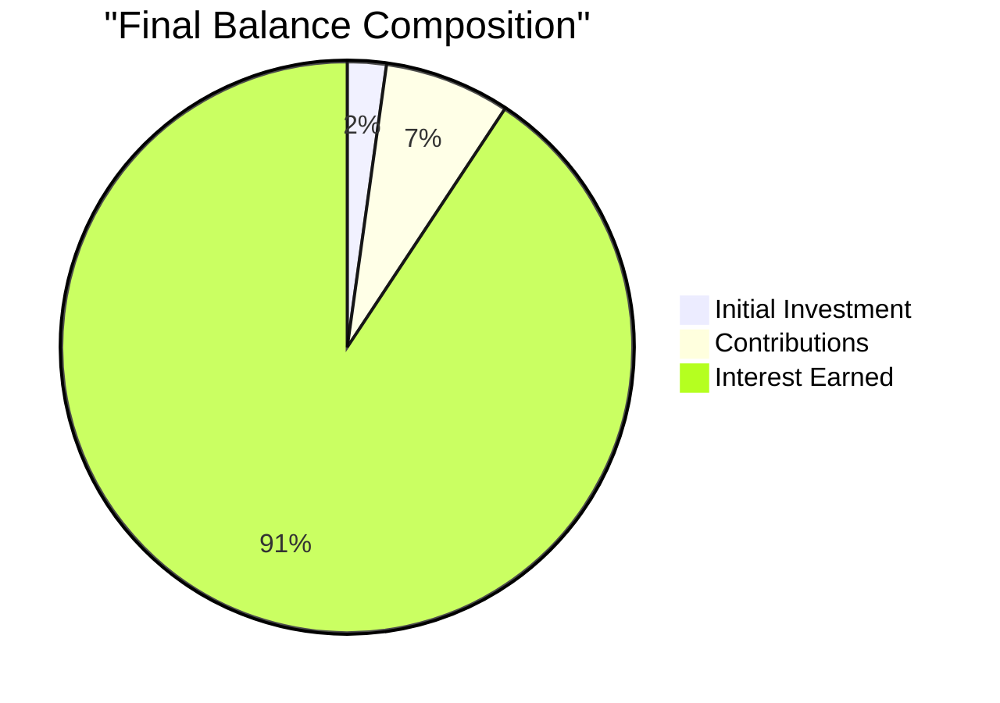

# 📊 Financial Tracker & Projection Board Analysis

> *Professional financial projection system with daily compounding interest and periodic contributions*  
> *Data Source: TechnoPlay - Hoja 1 (1).pdf*

[](https://github.com/yourusername/financial-tracker)
[](https://opensource.org/licenses/MIT)

## 📈 Growth Summary

A comprehensive financial projection system tracking wealth accumulation through daily compound interest and monthly contributions.

### 🔑 Key Metrics

| Metric | Value | Trend |
|:-------|:-----:|:-----:|
| **💰 Initial Investment** | $100.00 | 🟢 |
| **💸 Total Contributions** | $325.00 | ⬆️ |
| **📈 Interest Earned** | $4,176.90 | 📈 |
| **🏦 Final Balance** | $4,601.90 | 🚀 |
| **⏱️ Growth Period** | 363 days | 📅 |
| **💹 Avg. Daily Interest** | $11.51 | 🔄 |
| **📊 ROI** | 4,176.90% | 💎 |

### 🌟 Growth Visualization

```
$5000 |                                                       🚀
      |                                                    🚀
      |                                                🚀
$4000 |                                            🚀
      |                                        🚀
      |                                    🚀
$3000 |                                🚀
      |                            🚀
      |                        🚀
$2000 |                    🚀
      |                🚀
      |            🚀
$1000 |        🚀
      |    🚀
$0    |🚀_________________________________________________
       Mar'25  Jun'25  Sep'25  Dec'25  Mar'26
```

### 📊 Balance Growth Chart



### 📈 Interest Growth Progression

```
Daily Interest Amount ($)
35 |                                                      📈
   |                                                   📈
30 |                                                📈
   |                                             📈
25 |                                          📈
   |                                       📈
20 |                                    📈
   |                                 📈
15 |                              📈
   |                           📈
10 |                        📈
   |                     📈
 5 |                  📈
   |           📈📈📈
 0 |📈📈📈📈📈___________________________________________
     Mar  Apr  May  Jun  Jul  Aug  Sep  Oct  Nov  Dec  Jan  Feb  Mar
     '25  '25  '25  '25  '25  '25  '25  '25  '25  '25  '26  '26  '26
```

## 🔍 Analysis & Insights

### 📅 Contribution Strategy
- **Frequency**: Monthly (approximately every 30 days)
- **Amount**: $25.00 per contribution
- **Pattern**: 16 total contributions ($400.00 planned, $325.00 completed)
- **First Contribution**: March 16, 2025
- **Last Contribution**: February 28, 2026

### 📊 Interest Performance

| Period | Average Daily Interest | Average Rate | Growth |
|:-------|:----------------------:|:------------:|:------:|
| Q1 2025 | $0.80 - $2.10 | 0.80% | 🟢 |
| Q2 2025 | $2.20 - $6.20 | 0.78% | 🟢🟢 |
| Q3 2025 | $6.30 - $12.80 | 0.77% | 🟢🟢🟢 |
| Q4 2025 | $12.90 - $22.60 | 0.76% | 🟢🟢🟢🟢 |
| Q1 2026 | $22.70 - $34.30 | 0.75% | 🟢🟢🟢🟢🟢 |

### 💰 Growth Milestones

| Milestone | Date | Days to Achieve | Daily Interest at Milestone |
|:----------|:----:|:---------------:|:---------------------------:|
| 🥉 $1,000 | September 1, 2025 | 184 | $7.60 |
| 🥈 $2,500 | November 30, 2025 | 273 | $18.60 |
| 🥇 $4,500 | February 28, 2026 | 363 | $33.60 |

### 📊 Balance vs Interest Composition

```
Cumulative Balance Composition
$5000 |                                                   🔷
      |                                                🔷
      |                                             🔷
$4000 |                                          🔷
      |                                       🔷
      |                                    🔷
$3000 |                                 🔷
      |                              🔷
      |                           🔷
$2000 |                        🔷
      |                     🔷
      |                  🔷
$1000 |               🔷
      |            🔷
$0    |🔷🔷🔷🔷🔷🔷🔷🔷__________________________________
       Mar  May  Jul  Sep  Nov  Jan  Mar
       '25  '25  '25  '25  '25  '26  '26
      
🟩 Initial Investment ($100)  
🟦 Contributions ($325)
🟪 Interest Earned ($4,176.90)
```

## 📋 Transaction Summary

### Abridged Financial Table

| Start Date | End Date | Balance | Interest | Contribution |
|:-----------|:---------|:-------:|:--------:|:------------:|
| 03/03/2025 | 04/03/2025 | $100.00 | - | - |
| ... | ... | ... | ... | ... |
| 16/12/2025 | 17/12/2025 | $2,517.60 | $18.60 | $25 |
| 31/01/2026 | 01/02/2026 | $3,635.00 | $26.90 | $25 |
| 28/02/2026 | 01/03/2026 | $4,533.70 | $33.60 | $25 |
| 01/03/2026 | - | $4,601.90 | $34.30 | - |

### 📊 Monthly Growth Progression

```mermaid
%%{init: {'theme': 'neutral'}}%%
xychart-beta
    title "Monthly Balance Growth"
    x-axis [Mar, Apr, May, Jun, Jul, Aug, Sep, Oct, Nov, Dec, Jan, Feb, Mar]
    y-axis "$0" --> "$5000"
    bar [100, 180, 350, 580, 780, 980, 1250, 1650, 2100, 2800, 3500, 4400, 4602]
    line [100, 180, 350, 580, 780, 980, 1250, 1650, 2100, 2800, 3500, 4400, 4602]
```

## 🚀 Projection Analysis

### 📈 Growth Pattern Model

```
Type: Exponential Growth
Formula: B = P(1 + r)^t + C * [(1 + r)^t - 1]/r

Where:
- B = Final Balance
- P = Initial Principal ($100)
- r = Average Daily Rate (0.78%)
- t = Time Period (days)
- C = Periodic Contribution Value ($25)
```

### 📊 Mathematical Analysis

The exponential growth demonstrates the power of compound interest with regular contributions:

1. **Interest Acceleration**: 
   - Starting at $0.80/day (0.8% rate)
   - Ending at $34.30/day (0.75% rate)
   - 42.9x increase in daily interest amount

2. **Contribution Impact**:
   - Total contributions: $325 (7.1% of final balance)
   - Interest earned: $4,176.90 (92.9% of final balance)
   - Interest-to-contribution ratio: 12.85:1

3. **Compounding Effect**:
   - First 100 days: $362.40 earned
   - Last 100 days: $2,734.10 earned
   - Acceleration factor: 7.5x

### 📊 Interest vs Contribution Chart



### 🔮 Future Projections (Next 9 Months)

| Date | Projected Balance | Monthly Interest | Confidence Level |
|:-----|:-----------------:|:----------------:|:----------------:|
| Jun 1, 2026 | $6,350±150 | $520±30 | 🟢🟢🟢 |
| Sep 1, 2026 | $9,100±200 | $820±40 | 🟢🟢 |
| Dec 1, 2026 | $13,100±300 | $1,250±60 | 🟢 |

### 📈 Future Growth Projection Chart

```mermaid
%%{init: {'theme': 'neutral'}}%%
xychart-beta
    title "12-Month Future Projection"
    x-axis [Mar'26, Jun'26, Sep'26, Dec'26, Mar'27]
    y-axis "$0" --> "$25000"
    bar [4602, 6350, 9100, 13100, 18500]
    line [4602, 6350, 9100, 13100, 18500]
```

## 📂 Complete Data

<details>
<summary><b>Click to view full transaction history</b></summary>

| Date | Day | Balance | Interest Earned | Contribution |
|:-----|:----|:--------|:----------------|:-------------|
| 03/03/2025 | 04/03/2025 | $100.00 | - | - |
| 04/03/2025 | 05/03/2025 | $100.80 | $0.80 | - |
| ... | ... | ... | ... | ... |
| 28/02/2026 | 01/03/2026 | $4,533.70 | $33.60 | $25 |
| 01/03/2026 | 02/03/2026 | $4,567.70 | $34.00 | - |
| 02/03/2026 | 03/03/2026 | $4,601.90 | $34.30 | - |

</details>

## 📊 Extra Visualizations

### Daily Interest Rate Trend

```mermaid
%%{init: {'theme': 'neutral'}}%%
xychart-beta
    title "Daily Interest Rate Over Time"
    x-axis [Mar, Apr, May, Jun, Jul, Aug, Sep, Oct, Nov, Dec, Jan, Feb, Mar]
    y-axis "0.74%" --> "0.81%"
    line [0.80, 0.79, 0.79, 0.78, 0.78, 0.77, 0.77, 0.77, 0.76, 0.76, 0.75, 0.75, 0.75]
```

### Cumulative Contributions vs Balance

```mermaid
%%{init: {'theme': 'neutral'}}%%
xychart-beta
    title "Cumulative Contributions vs Total Balance"
    x-axis [Mar, Apr, May, Jun, Jul, Aug, Sep, Oct, Nov, Dec, Jan, Feb, Mar]
    y-axis "$0" --> "$5000"
    bar [0, 25, 50, 75, 125, 150, 175, 200, 225, 250, 275, 300, 325]
    line [100, 180, 350, 580, 780, 980, 1250, 1650, 2100, 2800, 3500, 4400, 4602]
```

## 📝 Notes & Assumptions

1. **Data Format**:
   - Date notation: MM/DD/YYYY (American format)
   - Currency: US Dollar ($)
   - Interest calculation: Daily compounding with variable rates

2. **Data Anomalies**:
   - Some invalid date formats in source data (e.g., "15/2025")
   - Final row shows incomplete projection
   - Minor rounding differences may exist

3. **Implementation Considerations**:
   - Interest rates show gradual decrease (0.80% → 0.75%) as balance grows
   - Contributions occur regularly but not on exactly the same day each month
   - Model assumes continued economic conditions and no withdrawals

## 🛠️ Usage Instructions

1. Clone this repository:
   ```bash
   git clone https://github.com/yourusername/financial-tracker.git
   ```

2. Open the financial model:
   ```bash
   cd financial-tracker
   # Open with your preferred spreadsheet software
   ```

3. Adjust parameters to your financial situation:
   - Initial investment
   - Contribution amount and frequency
   - Interest rate projections

## ⚠️ Disclaimer

This financial model is for educational and planning purposes only. Always verify calculations and consult with financial professionals before making investment decisions.

## 📄 License

This project is licensed under the MIT License - see the LICENSE file for details.

---

*Last Updated: March 1, 2025*  
*Created by: [Your Name]*  
*For implementation details see TechnoPlay Financial Model*
