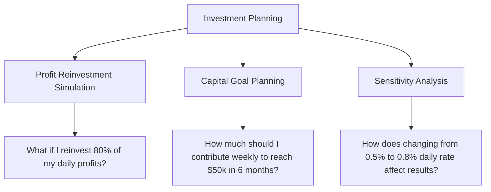

# Dynamic Financial Projection Dashboard

> **Interactive tool for visualizing investment growth with daily compound interest and periodic contributions**

## Overview

This dashboard allows real-time simulation of financial scenarios, showing how an initial investment evolves considering:

- **Daily compound interest** (customizable)
- **Periodic contributions** (weekly, bi-weekly, monthly, or custom)
- **External deposit uploads** via CSV files

### Ideal for:
- Planning short/medium-term investment strategies
- Visualizing compound interest impact
- Comparing different contribution scenarios

## Key Features

| Dynamic Parameters | Interactive Visualizations | Real-Time Projections |
|-------------------|---------------------------|----------------------|
| • Initial amount<br>• Daily interest rate<br>• Contribution frequency | • Balance evolution<br>• Contributions vs. interest breakdown<br>• Daily interest analysis | • Automatic calculations when values change<br>• Detailed transaction history<br>• Data export |

## Quick Start Guide

### 1. Initial Setup (Side Bar)

- **Initial Investment**: Starting capital amount
- **Daily Interest Rate**: Daily return percentage (e.g., 0.75% = ~300% annual)
- **Start Date**: Projection start day

### 2. Contribution Schedule

- **Frequency**:
  - Automatic (Weekly/Bi-weekly/Monthly)
  - Custom (Upload CSV)

- **Required CSV Format**:
```csv
Date,Amount
2024-01-15,500
2024-02-01,300
```

### 3. Results Interpretation

- **Key Metrics**:
  - Final Balance
  - Accumulated Interest
  - Total Contributed

- **Main Charts**:
  1. Balance Time Progression
  2. Capital Composition (Initial vs. Contributions vs. Interest)
  3. Daily Generated Interest Detail

## Common Use Cases



## Important Considerations

- **Data Security**: CSV files are processed locally (not stored)
- **Accuracy**: Calculations based on complete calendar days
- **Customization**: Contact the technical team to adjust:
  - Taxes/Fees
  - Withdrawal limits
  - Multiple currencies

## Technical Support

For custom inquiries or error reporting: 📩 cryptoplaza.hq@gmail.com

**Version 1.1** - Updated: March 2025

