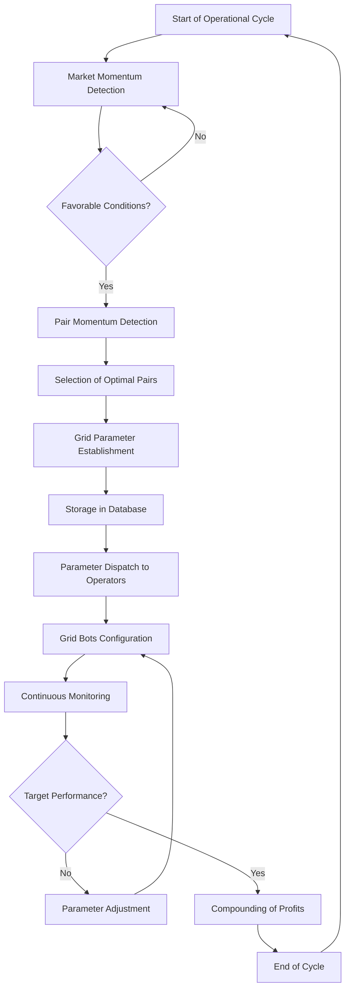

# Maverick Strategy: Sustainable and Scalable Grid Trading System

## Executive Summary

The Maverick Strategy represents the culmination of our first development phase, designed to implement a sustainable Grid Trading system on Bybit futures with a daily compound return target of 1.5% to 2%. This document details our methodology, workflow, optimized parameters, and implementation plan that will allow us to progress from sustainability to scalability.

## Table of Contents

1. [Introduction](#introduction)
2. [Overview](#overview)
3. [Applied Agile Methodology](#applied-agile-methodology)
4. [System Architecture](#system-architecture)
5. [Operational Workflow](#operational-workflow)
6. [Optimized Parameters](#optimized-parameters)
7. [Risk Management](#risk-management)
8. [Performance Metrics](#performance-metrics)
9. [Roadmap to Automation](#roadmap-to-automation)
10. [Conclusions](#conclusions)

## Introduction

The Maverick project emerges as a response to the need for developing a sustainable and scalable strategy for operating in futures markets using Grid Trading. After numerous tests, calculations, and analyses, we have identified optimal parameters that minimize liquidation risk while maximizing return potential.

The name "Maverick" reflects the system's agility and adaptability to navigate the volatile conditions of the cryptocurrency market while maintaining operational consistency.

## Overview

### Main Objective
Develop a portfolio of grid bots that operate sustainably with a daily compound return of 1.5% to 2%, avoiding operations that close at a loss through optimized parameters.

### Development Phases
1. **Sustainability** (Current Phase): Consolidation of parameters that prevent liquidations
2. **Scalability**: Progressive optimization of operations
3. **Automation**: Implementation of API-based management

## Applied Agile Methodology

We have implemented agile principles to allow rapid adaptations to changing market conditions:

| Agile Principle | Implementation in Maverick |
|----------------|----------------------------|
| Sprints | 7-day test cycles to validate parameters |
| Retrospectives | Post-operation analysis of performance and improvement opportunities |
| Continuous Iteration | Parameter adjustment based on market feedback |
| Incremental Delivery | Gradual incorporation of new pairs and strategies |
| Self-organization | Teams of operators with supervised autonomy |

## System Architecture

The Maverick system architecture is divided into four main components:

1. **Market Analysis Module**: Detects global momentum and specific pairs
2. **Parameterization Engine**: Establishes optimal configurations based on detected conditions
3. **Execution System**: Implements grid bots on Bybit with established parameters
4. **Operational Database**: Stores configurations, results, and performance metrics

## Operational Workflow

### Workflow Detail

1. **Market Momentum Detection**
   - Technical analysis of main cryptocurrency indices
   - Evaluation of market volatility and volume
   - Identification of macro trends

2. **Pair Momentum Detection**
   - Analysis of relative strength of specific pairs
   - Evaluation of price and volume patterns
   - Calculation of momentum indicators (RSI, MACD, etc.)

3. **Parameter Establishment**
   - Configuration of upper and lower grid limits
   - Determination of optimal number of grids
   - Calculation of position size per grid
   - Establishment of dynamic take profit and stop loss

4. **Parameter Dispatch**
   - Documentation of configurations in the database
   - Distribution of parameters to operators
   - Verification of correct implementation

## Optimized Parameters

Through extensive testing, we have identified the following optimal parameters for different market conditions:

### Bullish Market (Low to Medium Volatility)
- Grid Range: 3-5% of current price
- Number of Grids: 15-20
- Leverage: 3-5x
- Capital Allocation: 15% of portfolio per grid bot

### Sideways Market (Medium Volatility)
- Grid Range: 5-8% of current price
- Number of Grids: 20-25
- Leverage: 2-3x
- Capital Allocation: 20% of portfolio per grid bot

### Controlled Bearish Market (Medium to High Volatility)
- Grid Range: 8-12% of current price
- Number of Grids: 25-30
- Leverage: 1-2x
- Capital Allocation: 10% of portfolio per grid bot

## Risk Management

The Maverick strategy incorporates multiple layers of risk management:

1. **Pair Diversification**
   - Maximum 20% of capital in a single pair
   - Maximum correlation between pairs of 0.7

2. **Leverage Control**
   - Maximum leverage of 5x under optimal conditions
   - Automatic leverage reduction with increased volatility

3. **Drawdown Monitoring**
   - Maximum drawdown tolerance of 15% per account
   - Exposure reduction protocol when reaching 10% drawdown

4. **Capital Reserve**
   - Maintenance of 30% of capital as a safety reserve
   - Staggered use of capital to avoid overexposure

5. **Closing Protocols**
   - Predefined criteria for early closure of operations
   - Rules for taking partial profits at specific targets

## Performance Metrics

To evaluate the success of the Maverick strategy and make adjustments, we monitor the following metrics:

| Metric | Target | Calculation Method |
|---------|----------|-------------------|
| Daily Return | 1.5%-2% | (Final Capital - Initial Capital) / Initial Capital * 100 |
| Success Rate | >85% | Profitable Operations / Total Operations * 100 |
| Sharpe Ratio | >1.5 | (Average Return - Risk-Free Rate) / Standard Deviation |
| Maximum Drawdown | <15% | (Capital Peak - Capital Valley) / Capital Peak * 100 |
| Monthly ROI | >45% | Daily Compound Return Over 30 Days |

## Roadmap to Automation

The Maverick strategy is designed to progressively evolve towards complete automation:

### Phase 1: Sustainability (Current)
- Validation of optimal parameters
- Supervised manual implementation
- Development of configuration database

### Phase 2: Scalability (Q2 2025)
- Development of semi-automated scripts
- Implementation of real-time alerts
- Expansion to multiple correlated pairs
- Optimization of capital rotation

### Phase 3: Partial Automation (Q3 2025)
- Integration with Bybit API
- Automation of momentum detection
- Implementation of automatic parameter adjustments
- Development of monitoring dashboard

### Phase 4: Complete Automation (Q4 2025)
- Fully automated system
- Implementation of machine learning algorithms
- Dynamic parameter optimization
- Expansion to multiple exchanges

## Conclusions

The Maverick Strategy represents a systematic and optimized approach to Grid Trading in futures, designed to provide sustainable returns while minimizing the inherent risks of cryptocurrency trading.

We are in the sustainability phase, focused on consolidating parameters that prevent loss-making operations. With each iteration, we are accumulating valuable data that will allow us to progress towards scalability and eventually complete automation.

This document marks the completion of our first development stage and establishes the foundation for our sustainable and scalable operational projection.

---

*Document prepared by the Maverick Team*  
*Date: February 24, 2025*
