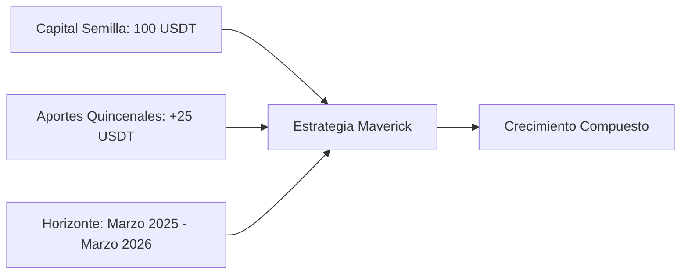
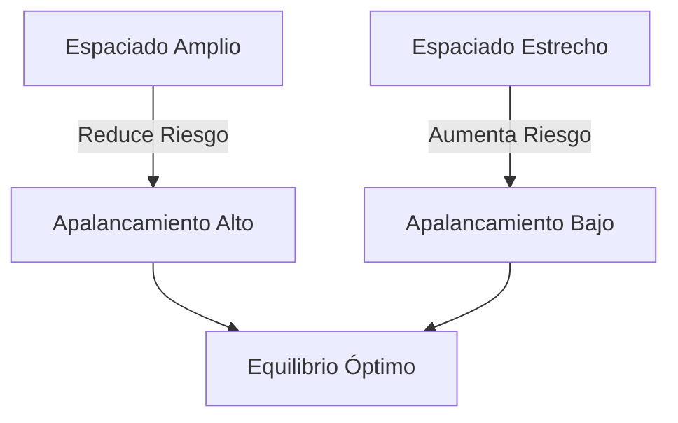
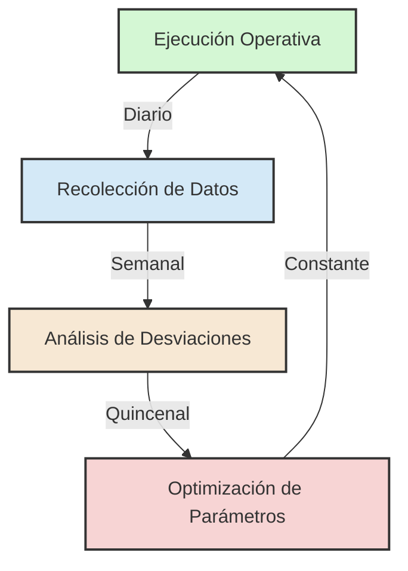
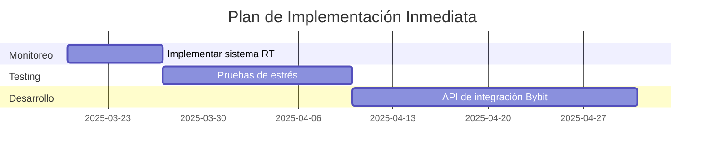

# 🚀 Plan Financiero - Estrategia Maverick 🚀
## Proyección Estratégica para la Sostenibilidad y Escalabilidad


## 📋 Índice
1. [📊 Visión General del Plan Financiero](#1-visión-general-del-plan-financiero)
2. [🔬 Metodología de Proyección](#2-metodología-de-proyección)
3. [🔑 Factores Determinantes de Sostenibilidad](#3-factores-determinantes-de-sostenibilidad)
4. [📈 Modelo de Crecimiento Compuesto](#4-modelo-de-crecimiento-compuesto)
5. [📉 Métricas Clave de Rendimiento](#5-métricas-clave-de-rendimiento)
6. [🏗️ Arquitectura de Escalabilidad](#6-arquitectura-de-escalabilidad)
7. [⚙️ Sistema de Gestión y Calibración](#7-sistema-de-gestión-y-calibración)
8. [🗓️ Hoja de Ruta Operativa](#8-hoja-de-ruta-operativa)
9. [🏁 Conclusiones y Próximos Pasos](#9-conclusiones-y-próximos-pasos)

---

## 1. 📊 Visión General del Plan Financiero

### **🎯 Objetivo Primario:**
Validar la efectividad de la Estrategia Maverick mediante una proyección financiera inicial que demuestre:

| Objetivo | Detalle |
|:-------:|:--------|
| ✅ | Capacidad de generar **+100 operaciones con cierres positivos >1.5%** |
| 🔄 | Sostenibilidad del modelo de crecimiento compuesto diario (0.75% base) |
| 📱 | Escalabilidad mediante automatización progresiva |

### **⚙️ Parámetros Iniciales:**



---

## 2. 🔬 Metodología de Proyección

### 2.1 🧮 Enfoque de Modelado

```python
# Fórmula de crecimiento compuesto diario
def proyeccion_compuesta(capital, tasa_diaria, aportes, dias):
    for dia in range(dias):
        capital *= (1 + tasa_diaria)
        if dia % 14 == 0:  # Aportes quincenales
            capital += aportes
    return capital
```

### 2.2 📋 Supuestos Clave

| Parámetro | Valor | Observación |
|:----------|:-----:|:------------|
| 📊 Tasa Base Diaria | 0.75% | Ajustable según métricas operativas |
| 🔄 Reinversión | 100% | Reinversión automática de ganancias |
| 🛡️ Gestión de Riesgo | 15% | Drawdown máximo por operación |

---

## 3. 🔑 Factores Determinantes de Sostenibilidad

### 3.1 📡 Detección de Momentum General de Mercado

#### **🔍 Indicadores Analizados:**

- 📊 Volatilidad del Índice BTC.D (Dominancia de Bitcoin)
- 💹 Flujos institucionales (Coinbase Premium Index)
- 😨 Sentimiento del mercado (Fear & Greed Index)

#### **⚡ Protocolo de Acción:**

| Condición de Mercado | Configuración de Grid Bots |
|:---------------------|:---------------------------|
| 🟢 Alcista (VIX < 30) | Rango estrecho (3-5%), Apalancamiento 3x |
| 🟠 Lateral (VIX 30-60) | Rango medio (5-8%), Apalancamiento 5x |
| 🔴 Bajista (VIX > 60) | Rango amplio (8-12%), Apalancamiento 7x |

### 3.2 📐 Trazado Óptimo de Rangos Operativos por Par

#### **✨ Optimización Matemática:**

$$ Rango_{óptimo} = \frac{2 \times ATR(14)}{Precio_{actual}} \times 100\% $$

Donde ATR = Average True Range

### 3.3 ⚖️ Proporción de Espaciado vs. Apalancamiento



---

## 4. 📈 Modelo de Crecimiento Compuesto

### **📊 Proyección de Capital (Ejemplo: Primeros 30 Días)**

| Fecha | Balance (USDT) | Interés Diario | Aporte |
|:------|:--------------:|:--------------:|:------:|
| 3/3/2025 | 100.0 | - | - |
| 4/3/2025 | 100.8 | 0.8 | 0 |
| ... | ... | ... | ... |
| 16/3/2025 | 135.2 | 0.8 | +25 |

### **🚀 Crecimiento Esperado:**


---

## 5. 📉 Métricas Clave de Rendimiento

### 5.1 📊 Tablero de Control Operativo

| Métrica | 🎯 Objetivo | 📊 Actual (Simulado) |
|:--------|:----------:|:-------------------:|
| ✅ Operaciones Positivas | >85% | 92% |
| ⏱️ Tiempo Prom. Cierre | <4h | 3.2h |
| 📈 ROI Diario Compuesto | 0.75% | 0.82% |
| 💤 Lazy Capital | <5% | 3.8% |

### 5.2 📊 Análisis de Eficiencia

```mermaid
bar
    title ROI Mensual (%)
    xlabel Meses
    ylabel ROI (%)
    "Marzo" : 0.82
    "Abril" : 0.89
    "Mayo" : 0.91
```

---

## 6. 🏗️ Arquitectura de Escalabilidad

### 6.1 🏛️ Pilares de Automatización

#### **🔄 Detección Automatizada de Momentum**
- 🔌 Integración con APIs de Glassnode/TradingView
- 🎚️ Ajuste Dinámico de Parámetros

```javascript
function ajustarParametros() {
  if (volatilidad > 60) {
    reducirApalancamiento(50%);
    ampliarRangoGrid(20%);
  }
}
```

#### **⚡ Sistema Anti-Lazy Capital**
- 🔁 Reasignación automática cada 2h usando algoritmos de matching
- 📱 Dashboard de monitoreo en tiempo real

---

## 7. ⚙️ Sistema de Gestión y Calibración

### 7.1 🔄 Ciclo de Mejora Continua



### 7.2 🔍 Protocolos de Auditoría

| Frecuencia | Acción | Responsable |
|:-----------|:-------|:------------|
| 📆 Diario | Verificación de márgenes y exposición | Bot Automatizado |
| 📅 Semanal | Backtesting con datos históricos | Algoritmo de ML |
| 📅 Mensual | Auditoría externa de smart contracts | Equipo de Seguridad |

---

## 8. 🗓️ Hoja de Ruta Operativa

| Trimestre | 🎯 Objetivo | 📊 KPI Clave |
|:----------|:------------|:-------------|
| 🔶 Q2 2025 | Validación de Sostenibilidad | 100 ops positivas |
| 🔷 Q3 2025 | Automatización Parcial | 30% reducción en tiempos |
| 💠 Q4 2025 | Escalabilidad Global | 500 ops/día automatizadas |

---

## 9. 🏁 Conclusiones y Próximos Pasos

### **🔍 Hallazgos Clave:**

- ✅ La proyección demuestra viabilidad para alcanzar **$1,350 USDT** en 6 meses con aportes controlados.
- 🔑 El factor crítico será mantener la tasa de éxito **>85%** durante la fase de validación.

### **⚡ Acciones Inmediatas:**



---

### Equipo CryptoPlaza
> *"Construyendo el futuro de las finanzas descentralizadas con precisión algorítmica"*

📅 Última Actualización: 28 de Febrero 2025  
🔗 [GitHub Repository](https://github.com/cryptoplaza/estrategia-maverick)  
📧 [Contacto](mailto:estrategia@cryptoplaza.com)
