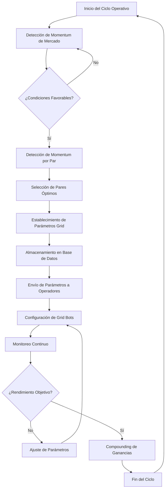

# Estrategia Maverick: Sistema de Grid Trading Sostenible y Escalable

## Resumen Ejecutivo

La Estrategia Maverick representa la culminación de nuestra primera fase de desarrollo, diseñada para implementar un sistema de Grid Trading sostenible en futuros de Bybit con un objetivo de rendimiento compuesto diario del 1.5% al 2%. Este documento detalla nuestra metodología, flujo de trabajo, parámetros optimizados y plan de implementación que nos permitirá avanzar desde la sostenibilidad hacia la escalabilidad.

## Índice

1. [Introducción](#introducción)
2. [Visión General](#visión-general)
3. [Metodología Ágil Aplicada](#metodología-ágil-aplicada)
4. [Arquitectura del Sistema](#arquitectura-del-sistema)
5. [Flujo de Trabajo Operativo](#flujo-de-trabajo-operativo)
6. [Parámetros Optimizados](#parámetros-optimizados)
7. [Gestión de Riesgos](#gestión-de-riesgos)
8. [Métricas de Rendimiento](#métricas-de-rendimiento)
9. [Roadmap hacia la Automatización](#roadmap-hacia-la-automatización)
10. [Conclusiones](#conclusiones)

## Introducción

El proyecto Maverick surge como respuesta a la necesidad de desarrollar una estrategia sostenible y escalable para operar en mercados de futuros utilizando Grid Trading. Tras numerosas pruebas, cálculos y análisis, hemos identificado parámetros óptimos que minimizan el riesgo de liquidación mientras maximizan el potencial de rendimiento.

El nombre "Maverick" refleja la agilidad y adaptabilidad del sistema para navegar las condiciones volátiles del mercado de criptomonedas mientras mantiene consistencia operativa.

## Visión General

### Objetivo Principal
Desarrollar un portafolio de grid bots que operen de manera sostenible con un rendimiento compuesto diario del 1.5% al 2%, evitando operaciones que cierren en pérdida mediante parámetros optimizados.

### Fases de Desarrollo
1. **Sostenibilidad** (Fase Actual): Consolidación de parámetros que evitan liquidaciones
2. **Escalabilidad**: Optimización progresiva de operaciones 
3. **Automatización**: Implementación de gestión vía API

## Metodología Ágil Aplicada

Hemos implementado principios ágiles para permitir adaptaciones rápidas a las condiciones cambiantes del mercado:

| Principio Ágil | Implementación en Maverick |
|----------------|----------------------------|
| Sprints | Ciclos de prueba de 7 días para validar parámetros |
| Retrospectivas | Análisis post-operación de rendimiento y oportunidades de mejora |
| Iteración Continua | Ajuste de parámetros basado en retroalimentación del mercado |
| Entrega Incremental | Incorporación gradual de nuevos pares y estrategias |
| Autoorganización | Equipos de operadores con autonomía supervisada |

## Arquitectura del Sistema

La arquitectura del sistema Maverick se divide en cuatro componentes principales:

1. **Módulo de Análisis de Mercado**: Detecta momentum global y por pares específicos
2. **Motor de Parametrización**: Establece configuraciones óptimas según condiciones detectadas
3. **Sistema de Ejecución**: Implementa los grid bots en Bybit con los parámetros establecidos
4. **Base de Datos Operativa**: Almacena configuraciones, resultados y métricas de rendimiento

## Flujo de Trabajo Operativo

### Detalle del Flujo de Trabajo

1. **Detección de Momentum de Mercado**
   - Análisis técnico de índices principales de criptomonedas
   - Evaluación de volatilidad y volumen de mercado
   - Identificación de tendencias macro

2. **Detección de Momentum por Par**
   - Análisis de fortaleza relativa de pares específicos
   - Evaluación de patrones de precio y volumen
   - Cálculo de indicadores de momentum (RSI, MACD, etc.)

3. **Establecimiento de Parámetros**
   - Configuración de límites superior e inferior del grid
   - Determinación del número óptimo de grids
   - Cálculo de tamaño de posición por grid
   - Establecimiento de take profit y stop loss dinámicos

4. **Envío de Parámetros**
   - Documentación de configuraciones en la base de datos
   - Distribución de parámetros a operadores
   - Verificación de implementación correcta

## Parámetros Optimizados

A través de extensas pruebas, hemos identificado los siguientes parámetros óptimos para diferentes condiciones de mercado:

### Mercado Alcista (Volatilidad Baja a Media)
- Rango de Grid: 3-5% del precio actual
- Número de Grids: 15-20
- Apalancamiento: 3-5x
- Asignación de Capital: 15% del portafolio por grid bot

### Mercado Lateral (Volatilidad Media)
- Rango de Grid: 5-8% del precio actual
- Número de Grids: 20-25
- Apalancamiento: 2-3x
- Asignación de Capital: 20% del portafolio por grid bot

### Mercado Bajista Controlado (Volatilidad Media a Alta)
- Rango de Grid: 8-12% del precio actual
- Número de Grids: 25-30
- Apalancamiento: 1-2x
- Asignación de Capital: 10% del portafolio por grid bot

## Gestión de Riesgos

La estrategia Maverick incorpora múltiples capas de gestión de riesgos:

1. **Diversificación de Pares**
   - Máximo 20% de capital en un solo par
   - Correlación máxima entre pares del 0.7

2. **Control de Apalancamiento**
   - Apalancamiento máximo de 5x en condiciones óptimas
   - Reducción monitoreada de apalancamiento con aumento de volatilidad

3. **Monitoreo de Drawdown**
   - Tolerancia máxima de drawdown del 30% por cuenta
   - Protocolo de reducción de exposición al alcanzar 10% de drawdown

4. **Reserva de Capital**
   - Mantenimiento de 30% de capital como reserva de seguridad
   - Uso escalonado de capital para evitar sobreexposición

5. **Protocolos de Cierre**
   - Criterios predefinidos para cierre anticipado de operaciones
   - Reglas de toma de ganancias parciales en objetivos específicos

## Métricas de Rendimiento

Para evaluar el éxito de la estrategia Maverick y realizar ajustes, monitoreamos las siguientes métricas:

| Métrica | Objetivo | Método de Cálculo |
|---------|----------|-------------------|
| Rendimiento Diario | 1.5%-2% | (Capital Final - Capital Inicial) / Capital Inicial * 100 |
| Tasa de Éxito | >85% | Operaciones Rentables / Total Operaciones * 100 |
| Ratio de Sharpe | >1.5 | (Rendimiento Medio - Tasa Libre de Riesgo) / Desviación Estándar |
| Drawdown Máximo | <15% | (Pico de Capital - Valle de Capital) / Pico de Capital * 100 |
| ROI Mensual | >45% | Rendimiento Compuesto Diario Durante 30 Días |

## Roadmap hacia la Automatización

La estrategia Maverick está diseñada para evolucionar progresivamente hacia la automatización completa:

### Fase 1: Sostenibilidad (Actual)
- Validación de parámetros óptimos
- Implementación manual supervisada
- Desarrollo de base de datos de configuraciones

### Fase 2: Escalabilidad (Q2 2025)
- Desarrollo de scripts semi-automatizados
- Implementación de alertas en tiempo real
- Expansión a múltiples pares correlacionados
- Optimización de rotación de capital

### Fase 3: Automatización Parcial (Q3 2025)
- Integración con API de Bybit
- Automatización de detección de momentum
- Implementación de ajustes de parámetros automáticos
- Desarrollo de dashboard de monitoreo

### Fase 4: Automatización Completa (Q4 2025)
- Sistema completamente automatizado
- Implementación de algoritmos de machine learning
- Optimización dinámica de parámetros
- Expansión a múltiples exchanges

## Conclusiones

La Estrategia Maverick representa un enfoque sistemático y optimizado para el Grid Trading en futuros, diseñado para proporcionar rendimientos sostenibles mientras minimiza los riesgos inherentes al trading de criptomonedas.

Estamos en la fase de sostenibilidad, enfocados en la consolidación de parámetros que evitan operaciones en pérdida. Con cada iteración, estamos acumulando datos valiosos que nos permitirán avanzar hacia la escalabilidad y eventualmente la automatización completa.

Este documento marca la finalización de nuestra primera etapa de desarrollo y establece las bases para nuestra proyección operativa sostenible y escalable.

---

*Documento preparado por el Equipo CRYPTOPLAZA*  
*Fecha: 24 de febrero de 2025*
