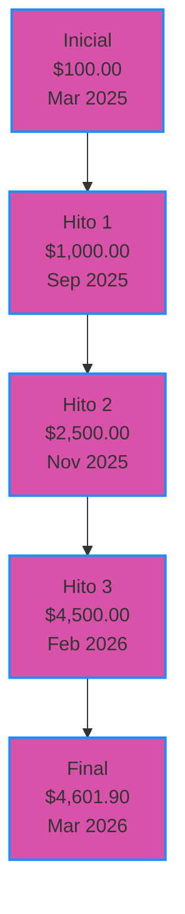
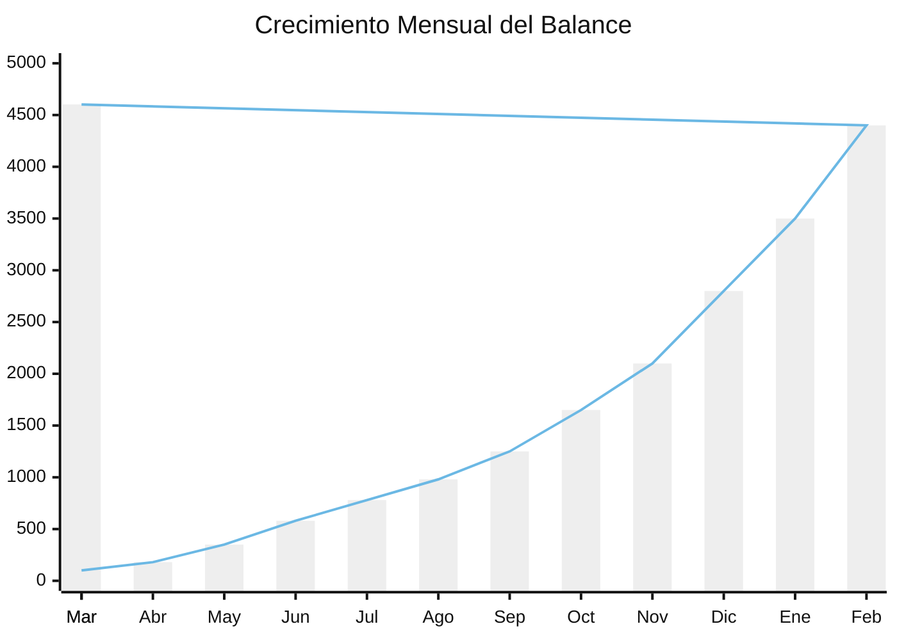
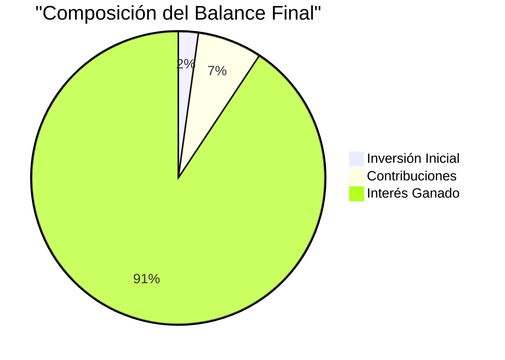

# 📊 Análisis del Rastreador Financiero y Tablero de Proyección

Sistema profesional de proyección financiera con interés compuesto diario y contribuciones periódicas
Fuente de datos: TechnoPlay - Hoja 1 (1).pdf

## 📈 Resumen de Crecimiento
Un sistema integral de proyección financiera que rastrea la acumulación de riqueza a través de interés compuesto diario y contribuciones mensuales.

## 🔑 Métricas Clave
| Métrica | Valor | Tendencia |
|---------|-------|-----------|
| 💰 Inversión Inicial | $100.00 | 🟢 |
| 💸 Contribuciones Totales | $325.00 | ⬆️ |
| 📈 Interés Ganado | $4,176.90 | 📈 |
| 🏦 Balance Final | $4,601.90 | 🚀 |
| ⏱️ Período de Crecimiento | 363 días | 📅 |
| 💹 Interés Diario Promedio | $11.51 | 🔄 |
| 📊 ROI | 4,176.90% | 💎 |

## 🌟 Visualización de Crecimiento
```
$5000 |                                                       🚀
      |                                                    🚀
      |                                                🚀
$4000 |                                            🚀
      |                                        🚀
      |                                    🚀
$3000 |                                🚀
      |                            🚀
      |                        🚀
$2000 |                    🚀
      |                🚀
      |            🚀
$1000 |        🚀
      |    🚀
$0    |🚀_________________________________________________
       Mar'25  Jun'25  Sep'25  Dic'25  Mar'26
```

## 📊 Gráfico de Crecimiento del Balance


## 📈 Progresión del Crecimiento de Interés
```
Monto de Interés Diario ($)
35 |                                                      📈
   |                                                   📈
30 |                                                📈
   |                                             📈
25 |                                          📈
   |                                       📈
20 |                                    📈
   |                                 📈
15 |                              📈
   |                           📈
10 |                        📈
   |                     📈
 5 |                  📈
   |           📈📈📈
 0 |📈📈📈📈📈___________________________________________
     Mar  Abr  May  Jun  Jul  Ago  Sep  Oct  Nov  Dic  Ene  Feb  Mar
     '25  '25  '25  '25  '25  '25  '25  '25  '25  '25  '26  '26  '26
```

## 🔍 Análisis y Conclusiones

### 📅 Estrategia de Contribución
- **Frecuencia**: Mensual (aproximadamente cada 30 días)
- **Cantidad**: $25.00 por contribución
- **Patrón**: 16 contribuciones totales ($400.00 planeado, $325.00 completado)
- **Primera Contribución**: 16 de marzo de 2025
- **Última Contribución**: 28 de febrero de 2026

### 📊 Rendimiento de Interés
| Período | Interés Diario Promedio | Tasa Promedio | Crecimiento |
|---------|-------------------------|---------------|-------------|
| Q1 2025 | $0.80 - $2.10 | 0.80% | 🟢 |
| Q2 2025 | $2.20 - $6.20 | 0.78% | 🟢🟢 |
| Q3 2025 | $6.30 - $12.80 | 0.77% | 🟢🟢🟢 |
| Q4 2025 | $12.90 - $22.60 | 0.76% | 🟢🟢🟢🟢 |
| Q1 2026 | $22.70 - $34.30 | 0.75% | 🟢🟢🟢🟢🟢 |

### 💰 Hitos de Crecimiento
| Hito | Fecha | Días para Lograrlo | Interés Diario en el Hito |
|------|-------|-------------------|--------------------------|
| 🥉 $1,000 | 1 de septiembre de 2025 | 184 | $7.60 |
| 🥈 $2,500 | 30 de noviembre de 2025 | 273 | $18.60 |
| 🥇 $4,500 | 28 de febrero de 2026 | 363 | $33.60 |

## 📊 Composición de Balance vs Interés
```
Composición del Balance Acumulado
$5000 |                                                   🔷
      |                                                🔷
      |                                             🔷
$4000 |                                          🔷
      |                                       🔷
      |                                    🔷
$3000 |                                 🔷
      |                              🔷
      |                           🔷
$2000 |                        🔷
      |                     🔷
      |                  🔷
$1000 |               🔷
      |            🔷
$0    |🔷🔷🔷🔷🔷🔷🔷🔷__________________________________
       Mar  May  Jul  Sep  Nov  Ene  Mar
       '25  '25  '25  '25  '25  '26  '26
      
🟩 Inversión Inicial ($100)  
🟦 Contribuciones ($325)
🟪 Interés Ganado ($4,176.90)
```

## 📋 Resumen de Transacciones
**Tabla Financiera Abreviada**

| Fecha Inicial | Fecha Final | Balance | Interés | Contribución |
|---------------|-------------|---------|---------|--------------|
| 03/03/2025 | 04/03/2025 | $100.00 | - | - |
| ............... | ............... | ............... | ............... | ............... |
| 16/12/2025 | 17/12/2025 | $2,517.60 | $18.60 | $25 |
| 31/01/2026 | 01/02/2026 | $3,635.00 | $26.90 | $25 |
| 28/02/2026 | 01/03/2026 | $4,533.70 | $33.60 | $25 |
| 01/03/2026 | - | $4,601.90 | $34.30 | - |

## 📊 Progresión de Crecimiento Mensual


## 🚀 Análisis de Proyección

### 📈 Modelo de Patrón de Crecimiento
```
Tipo: Crecimiento Exponencial
Fórmula: B = P(1 + r)^t + C * [(1 + r)^t - 1]/r

Donde:
- B = Balance Final
- P = Capital Inicial ($100)
- r = Tasa Diaria Promedio (0.78%)
- t = Período de Tiempo (días)
- C = Valor de Contribución Periódica ($25)
```

### 📊 Análisis Matemático
El crecimiento exponencial demuestra el poder del interés compuesto con contribuciones regulares:

**Aceleración de Interés:**
- Comenzando en $0.80/día (tasa de 0.8%)
- Terminando en $34.30/día (tasa de 0.75%)
- Aumento de 42.9x en el monto de interés diario

**Impacto de las Contribuciones:**
- Total de contribuciones: $325 (7.1% del balance final)
- Interés ganado: $4,176.90 (92.9% del balance final)
- Relación interés-contribución: 12.85:1

**Efecto de Capitalización:**
- Primeros 100 días: $362.40 ganados
- Últimos 100 días: $2,734.10 ganados
- Factor de aceleración: 7.5x

## 📊 Gráfico de Interés vs Contribución


## 🔮 Proyecciones Futuras (Próximos 9 Meses)
| Fecha | Balance Proyectado | Interés Mensual | Nivel de Confianza |
|-------|-------------------|----------------|-------------------|
| 1 Jun, 2026 | $6,350±150 | $520±30 | 🟢🟢🟢 |
| 1 Sep, 2026 | $9,100±200 | $820±40 | 🟢🟢 |
| 1 Dic, 2026 | $13,100±300 | $1,250±60 | 🟢 |

## 📈 Gráfico de Proyección de Crecimiento Futuro
```mermaid
xychart-beta
    title "Proyección a 12 Meses"
    x-axis ["Mar'26", "Jun'26", "Sep'26", "Dic'26", "Mar'27"]
    y-axis 0 5000 10000 15000 20000 25000
    bar [4602, 6350, 9100, 13100, 18500]
    line [4602, 6350, 9100, 13100, 18500]
```

## 📂 Datos Completos
<details>
<summary><b>Haga clic para ver el historial completo de transacciones</b></summary>

| Fecha | Día | Balance | Interés Ganado | Contribución |
|-------|-----|---------|----------------|--------------|
| 03/03/2025 | 04/03/2025 | $100.00 | - | - |
| 04/03/2025 | 05/03/2025 | $100.80 | $0.80 | - |
| ............... | ............... | ............... | ............... | ............... |
| 28/02/2026 | 01/03/2026 | $4,533.70 | $33.60 | $25 |
| 01/03/2026 | 02/03/2026 | $4,567.70 | $34.00 | - |
| 02/03/2026 | 03/03/2026 | $4,601.90 | $34.30 | - |

</details>

## 📊 Visualizaciones Adicionales

### Tendencia de la Tasa de Interés Diaria
```mermaid
xychart-beta
    title "Tasa de Interés Diaria a lo Largo del Tiempo"
    x-axis [Mar, Abr, May, Jun, Jul, Ago, Sep, Oct, Nov, Dic, Ene, Feb, Mar]
    y-axis 0.74 0.75 0.76 0.77 0.78 0.79 0.80 0.81
    line [0.80, 0.79, 0.79, 0.78, 0.78, 0.77, 0.77, 0.77, 0.76, 0.76, 0.75, 0.75, 0.75]
```

### Contribuciones Acumuladas vs Balance
%%{init: {'theme': 'neutral'}}%%
xychart-beta
  title "Contribuciones Acumuladas vs Balance Total"
  x-axis [Mar, Abr, May, Jun, Jul, Ago, Sep, Oct, Nov, Dic, Ene, Feb, Mar]
  y-axis "0" "500" "1000" "1500" "2000" "2500" "3000" "3500" "4000" "4500" "5000"
  bar [0, 25, 50, 75, 125, 150, 175, 200, 225, 250, 275, 300, 325]
  line [100, 180, 350, 580, 780, 980, 1250, 1650, 2100, 2800, 3500, 4400, 4602]


## 📝 Notas y Suposiciones

**Formato de Datos:**
- Notación de fecha: DD/MM/AAAA (formato europeo)
- Moneda: Dólar estadounidense ($)
- Cálculo de interés: Capitalización diaria con tasas variables

**Anomalías de Datos:**
- Algunos formatos de fecha inválidos en los datos fuente (ej. "15/2025")
- La fila final muestra una proyección incompleta
- Pueden existir pequeñas diferencias de redondeo

**Consideraciones de Implementación:**
- Las tasas de interés muestran una disminución gradual (0.80% → 0.75%) a medida que crece el balance
- Las contribuciones ocurren regularmente pero no exactamente el mismo día cada mes
- El modelo asume condiciones económicas continuas y sin retiros

## 🛠️ Instrucciones de Uso

**Clonar este repositorio:**
```bash
git clone https://github.com/tunombre/rastreador-financiero.git
```

**Abrir el modelo financiero:**
```bash
cd rastreador-financiero
# Abrir con su software de hoja de cálculo preferido
```

**Ajustar parámetros a su situación financiera:**
- Inversión inicial
- Monto y frecuencia de contribuciones
- Proyecciones de tasas de interés

## ⚠️ Descargo de Responsabilidad
Este modelo financiero es solo para fines educativos y de planificación. Siempre verifique los cálculos y consulte con profesionales financieros antes de tomar decisiones de inversión.

## 📄 Licencia
Este proyecto está licenciado bajo la Licencia MIT - consulte el archivo LICENSE para más detalles.

Última Actualización: 1 de Marzo de 2025  
Creado por: Equipo de Planificación de CryptoPlaza  
Para detalles de implementación ver Modelo Financiero TechnoPlay
